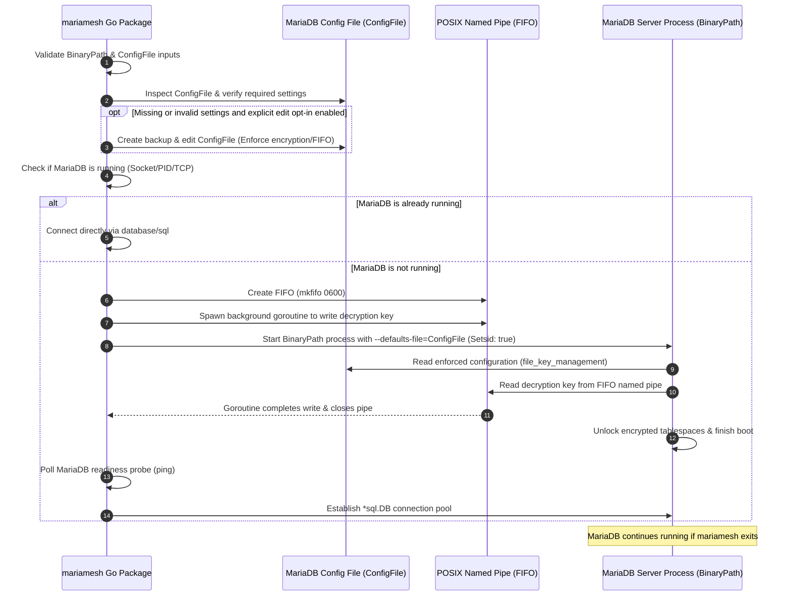
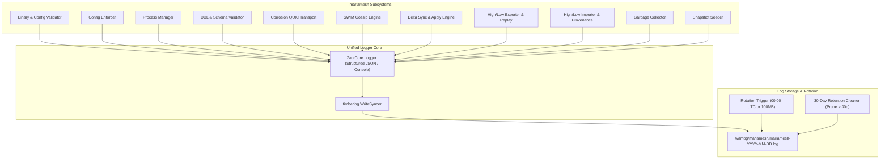

# MARIAMESH: Decentralized Multi-Master & Cross-Domain Replication for MariaDB

`mariamesh` is an embeddable Go package providing masterless, multi-primary asynchronous database replication across a distributed mesh of MariaDB nodes, as well as secure, unidirectional **High/Low Air-Gap Replication** across classified and unclassified security domains. It targets GALVANIZE replacement through HLC per-field Last-Write-Wins (LWW), transactional trigger-based CDC, managed MariaDB startup with explicit binary/config inputs and validated encryption settings, an opt-in auditable config enforcer and FIFO key handoff, structured logging, and a Go QUIC/gossip mesh. This document describes the target; the current package does not yet ship all of these capabilities or the GALVANIZE-facing API and operations surfaces.

## GALVANIZE Replacement Contract and Open Decisions

The MariaDB replication engine is only one part of a GALVANIZE replacement. Before declaring parity, inventory deployed GALVANIZE configurations, schemas, SQL queries, Go client calls, stored files, High/Low artifacts, and operator workflows. Record for each capability whether MARIAMESH provides a compatible endpoint, a documented migration, or an explicitly accepted removal. The default release gate is that no used capability is silently lost.

| GALVANIZE capability | Required MARIAMESH plan and acceptance criterion |
| --- | --- |
| Application SQL and public API | Provide a MariaDB `database/sql` migration path for GALVANIZE's Go client, including PostgreSQL-wire DSN and placeholder changes. Decide whether to retain `POST /v1/queries`, `POST /v1/transactions`, `/v1/health`, `/v1/table_stats`, and PostgreSQL-wire listeners; if retained, define supported SQLite-to-MariaDB SQL, bound blob representation, multi-statement transaction atomicity, errors/timeouts, bearer-token authorization, read-only listeners, and health/table-stat responses. Document PostgreSQL-wire compatibility limits rather than promising full PostgreSQL semantics. Test calls from the actual Go SDK. Direct MariaDB SQL alone is a breaking client change. |
| Managed schema | Inventory GALVANIZE schema files, views, indexes, primary keys, defaults, SQLite types/functions, and SQL dialect. Define a repeatable conversion into MariaDB migrations, including identifiers, indexes/views, defaults, online rollout, and schema mismatch behavior. The current mandatory `id` UUIDv5 plus `name` rule excludes ordinary GALVANIZE tables with integer, text, or composite primary keys; choose either a compatible identity model or a documented remapping with foreign-reference and client-query migration. Reject unsupported schemas before cutover. |
| Streaming and subscriptions | Match query-result streaming and subscriptions: initial query snapshot, ordered change notifications (document GALVANIZE's non-preserved row ordering), table update streams, subscription ID/info/list, resumable cursors, end-of-query watermarks, retention, slow-consumer/backpressure policy, cancellation, timeouts, and reconnect behavior. A changelog by itself is not a public subscription API. |
| Encrypted files | Port `POST /v1/files/upload`, UUID upload, `GET /v1/files/{uuid}`, metadata/search/stats, `DELETE`, sync, and peer-fetch routes; replicated metadata; encrypted local payloads; size/path/access controls; peer fetch/cache; and Low-to-High recipient-sealed file transfer. Match upload/peer acceptance flags and define whether `files.enabled` gates routes. Define local key derivation, rotation, delete propagation, and restore. Verify files remain readable after migration and remote fetch. |
| Administration and observability | Provide or migrate health/locked status, local admin Unix socket or CLI, remote mTLS `POST /v1/admin/commands`, High/Low mTLS status/replay/provenance routes, membership inspection, forced sync/repair, schema reload, backup/restore, key rotation, Prometheus metrics, and Go admin-client calls. Preserve access-control boundaries and document endpoint and command changes. |
| Lock, unlock, and key lifecycle | Match GALVANIZE's locked-start behavior: provide health while locked, defer SQL/peer/replication listeners and workers until unlock, accept secrets through protected `/v1/admin/unlock`-equivalent API or callback, keep key material only in zeroized memory, and reject bad keys without crashing. Specify offline MariaDB rekey and recovery procedures; the FIFO key-file handoff alone does not cover these workflows. Set a supported MariaDB version/edition matrix: the file key plugin consumes a key file with key IDs and hex key material, and its key-version rotation support varies by edition/version. Do not claim rotation based only on `innodb_encryption_rotate_key_age`; test the selected plugin/version and data migration path. Decide whether health/unlock are bearer-authenticated and define access to the listener while locked. |
| Backup, restore, and reseed | Define MariaDB-consistent backup and restore, including metadata, encryption keys, external file payloads, and node/incarnation state. Support a documented reseed workflow that removes or regenerates node-local identity and progress state while preserving application data and schema. The online join snapshot is not a backup/restore feature. |
| Schema reload and views | Port GALVANIZE's managed table/index/view behavior: deterministic schema diff/reload, local derived views, safe additive changes, and explicit handling of destructive changes. Define MariaDB migration/locking behavior and schema-version coordination; views themselves are not replicated. |
| Operator CLI and node lifecycle | Inventory and map `agent`, `cluster`, `sync generate/reconcile-gaps/check-bookie-consistency/process-buffered-changes`, `reload`, `reload-dicts`, `backup`, `restore`, `rekey`, `tls`, `exec`, `query`, `subs list/info`, template, and Consul commands to package APIs or a companion Go CLI. Include bootstrap/rejoin/cluster-ID changes, membership states, forced sync and repair, logging filters, Plumtree stats, drain/retire, status, and recovery workflows with documented authorization. |
| Database and runtime tuning | Inventory GALVANIZE database, gossip, sync, reaper, and performance settings. Map meaningful controls to MariaDB and package configuration (pool/connection limits, InnoDB/WAL-equivalent durability and cache settings, batch sizes, heartbeat, GC, and timeouts) with workload-specific defaults and observability. |
| Broadcast scalability | Preserve a documented broadcast strategy for expected cluster sizes. Compare all-peer/gossip fanout with GALVANIZE's optional Plumtree eager/lazy tree, `IHAVE`/`GRAFT`/`PRUNE`, batching, and bounded queue shedding; define ordering, duplicate handling, backpressure, and dropped-message recovery through anti-entropy. |
| TLS, authorization, and certificate lifecycle | Map public bearer-token auth, admin and High/Low mTLS boundaries, peer certificate identity binding, CA/server/client certificate generation, trust rotation/revocation, and plaintext-mode restrictions. Provide secure provisioning and rotation or document integration with an external PKI. |
| Telemetry | Provide Prometheus metrics and decide whether OpenTelemetry traces/metrics/log export are supported. Map database, replication, peer, queue, sync, membership, file, and High/Low signals to stable MARIAMESH names; document labels/cardinality, health endpoints, and alert guidance. |
| Deployment, packaging, and upgrades | Define supported Go embedding and companion-daemon/CLI deployment, Linux service/container examples, config and data directory ownership, MariaDB/package version compatibility, startup ordering, rolling upgrade and rollback, and schema/protocol compatibility rules. A library API alone does not replace GALVANIZE's runnable agent and deployment instructions. |
| Templates and Consul | Inventory state-driven Rhai templates, their SQL/context helpers, watch-and-rerender behavior and output-file safety, plus Consul local service registration and state sync. Port used behavior or provide tested replacements before retiring GALVANIZE. |
| Network policy | Port peer IP/CIDR allow-list enforcement to inbound and outbound QUIC, gossip, broadcasts, sync, and bootstrap, including IPv4/IPv6 pool selection. GALVANIZE defaults to wildcard allow (`["*"]`); choose and document MARIAMESH's default explicitly, migrate existing policy, and test denied peers cannot discover, join, or receive data. |
| High/Low roles and transport | Match exactly-one-role configuration (`low`, `high`, `high-replica`), accepted streams, authoritative High behavior, sequence-gap recovery, replay, waiting-schema, provenance, separate Low/High gossip meshes, and dedicated mTLS status/replay/provenance operations. Verify adapters against the checked-in implementation: directory, HTTP(S), and FTP(S) work; `smb` aliases directory; SFTP currently returns an unimplemented-transport error. Inventory config knobs currently accepted but not passed through (including host-key pins and TLS/private-key options), and never claim their security behavior until end-to-end tests prove it. Use environment-variable names for credentials and forbid secrets in endpoints. The HTTP adapter's artifact/manifests and separate `{uuid}.file` contracts need tests. Add S3 only as a new adapter with its own tests. |

### Compatibility boundaries that need explicit decisions

- **Mesh protocol:** `mariamesh-repl/1`, MariaDB CDC events, and HLC/LWW metadata do not interoperate with GALVANIZE's Corrosion/CR-SQLite mesh. Plan a one-time export/import or a versioned bridge; do not add MARIAMESH nodes to a live GALVANIZE mesh without a proven bridge.
- **High/Low artifacts:** The existing GALVANIZE `schema_hash` is SHA-256 over ordered `sqlite_schema.sql` entries, excluding internal objects. Hashing MariaDB DDL produces a different value even for equivalent tables. Version the new format or define a canonical cross-database schema and row-value mapping. Database-change bundles use signed manifests; file artifacts are a separate recipient-sealed format whose UUID is authenticated as associated data and whose bytes are checked against replicated SHA-256 metadata (they do not use the bundle manifest signature). Claim `galvanize-highlow/1` compatibility only after bidirectional golden-vector tests pass for manifests, signatures, values, keys, deletes, schema holds, replay, and file artifacts.
- **Conflict semantics:** HLC per-field LWW is a new algorithm, not proof of identical CR-SQLite outcomes. Specify tie-breaking, null/blob/JSON encoding, multi-column atomicity, update/delete races, clock skew, and mixed-version behavior; test convergence with the same workloads as GALVANIZE.
- **CR-SQLite behavior to compare:** GALVANIZE uses per-column `col_version`, CR-SQLite's tie-value ordering, causal-length/delete state, transaction change grouping, and actor/site identity. Capture those outcomes from `../GALVANIZE/doc/crdts.md` and live workloads as reference vectors; either document MARIAMESH's differences or prove compatibility for the cases deployed applications rely on.
- **Secrets and lifecycle:** Define how the MariaDB encryption key, High/Low keys, and TLS material enter memory without being stored in config, source, logs, or process arguments. Specify locked startup/unlock and offline rekey or a documented operational replacement. If attaching to an already-running MariaDB, verify encryption/plugin state before serving traffic. Back up both MariaDB data and external encrypted file payloads and prove restore.
- **MariaDB encryption support matrix:** Pin exact Community/Enterprise versions and supported plugins/options. The `file_key_management` plugin reads a key file containing key IDs and hex key material; it does not generate keys. Verify whether the selected version accepts the FIFO path and key-file format, whether key-file encryption/password input is needed, all configured encryption variables are supported, and every required tablespace/log is actually encrypted before startup succeeds. [MariaDB file-key plugin docs](https://mariadb.com/docs/server/security/encryption/data-at-rest-encryption/key-management-and-encryption-plugins/file-key-management-encryption-plugin) and [InnoDB encryption docs](https://mariadb.com/docs/server/security/encryption/data-at-rest-encryption/innodb-encryption/innodb-encryption-overview) are the compatibility references.
- **Checked-in GALVANIZE implementation limits:** The PostgreSQL-wire API is an experimental SQLite-SQL interface, not PostgreSQL SQL. GALVANIZE accepts some High/Low transport configuration that its adapter conversion does not currently use; SFTP operations are unimplemented, `smb` aliases directory, and file `enabled` does not currently gate routes. Verify against the source version and deployment before setting parity expectations. MARIAMESH should not copy accidental fail-open or incomplete behavior; preserve intentional deployed workflows and document safer replacements.
- **Current implementation versus target:** The product target is a Go package that controls MariaDB startup/configuration and replication. The current package instead takes an existing `*sql.DB`, injects a generic logger, and exposes migration SQL for the host to install; it does not implement the planned process manager, config/key lifecycle, package-owned DDL, Zap/timberlog logger, or GALVANIZE-facing services. In managed mode MARIAMESH obtains its SQL pool after launch using a connector/secret-provider callback; a pre-opened `*sql.DB` is attach mode only. Target lifecycle: MARIAMESH starts the configured MariaDB daemon as an independent process, monitors it while replication is active, fails replication and reports unhealthy on an unexpected exit (automatic database restart is separately configurable and off by default), and leaves MariaDB running on `Replicator.Close`; an explicit database shutdown operation is separate. Require an existing, explicitly configured datadir by default; initialize only a verified-empty datadir through an explicit provisioning operation, never implicitly adopt or overwrite an unknown directory. Define service-user permissions and startup failure cleanup. Config rewriting is opt-in and auditable; otherwise return a remediation report. Align README examples and API with these modes, and label target architecture separately from shipped behavior.
- **Parity source and scope:** The source inventory covers `../GALVANIZE/FORK_CHANGES.md`, `README.md`, `USAGE.md`, `doc/{api,cli,config,telemetry}`, `clients/go`, and the agent, CLI, and High/Low implementation. The active Go client also exists at `/home/marc/OVERWATCH v2.2/backend/pkgs/galvanize`. Recheck deployed configurations before cutover. Mark each surface `implemented`, `migration documented`, `unused/retired`, or `open`; link the evidence and owner. Do not declare parity while a deployed capability remains unclassified or imply that matching the replication protocol replaces GALVANIZE's service, CLI, and operations surfaces.

### Migration and release gates

1. Build a fixture from a real GALVANIZE deployment: schema including views/indexes, representative rows and blobs, encrypted files, configuration and tuning, client calls, operator commands, backup/reseed state, and pending High/Low bundles. Record counts and hashes without exposing secrets.
2. Implement an idempotent, resumable export/import with primary-key mapping, SQL type conversion, view/index recreation, file re-encryption, and provenance/High/Low sequence handling. Define a write freeze or dual-write/catch-up cutover, validation, and rollback procedure. Never treat a SQLite database file as a MariaDB data directory.
3. Run equivalent live scenarios on MariaDB: partitions/heal and rejoin, concurrent updates/deletes, crash recovery, large blobs, allow-list denial and dual-stack peers, locked startup/unlock/rekey, auth and read-only endpoints, schema drift/reload/views, High/Low roles plus corruption/replay/gaps, file peer fetch and air-gap delivery, backup/restore/reseed, admin repair commands, telemetry, deployment restart/upgrade, and Go client/operator workflows. Compare logical row and file contents across nodes; byte-identical database files are not a meaningful MariaDB criterion.
4. Require an operator-reviewed parity register with no unclassified deployed capabilities and successful restore and rollback rehearsal before replacing the GALVANIZE service in production.

---

## Architecture Overview

```mermaid
flowchart TD
    subgraph HostApp ["Host Application Process"]
        AppLogic["Application Business Logic"]
        SQLConn["Direct SQL (DML: INSERT / UPDATE / DELETE / SELECT)"]
        MM["mariamesh Package (Go)"]
        
        subgraph MMPkg ["mariamesh Engine"]
            InputVal["Binary Path & Config File Validator"]
            ConfMgr["MariaDB Config Validator / Opt-in Enforcer"]
            ProcMgr["MariaDB Process Manager & FIFO Key-File Provisioner"]
            DDLMgr["Package DDL & Schema Migration Engine"]
            ValEngine["Startup Schema & Trigger Validator"]
            CorrosionTrans["Corrosion P2P Transport (quic-go + SWIM Gossip)"]
            SyncEngine["State Sync & CRDT Apply Engine"]
            HLCClock["Hybrid Logical Clock (HLC)"]
            Logger["Unified Logger (Zap + timberlog)"]
        end
    end

    subgraph ConfigStorage ["Host Filesystem & OS"]
        MdbBin["MariaDB Server Binary (BinaryPath)"]
        MdbCnf["MariaDB Config File (ConfigFile)"]
        FIFOPipe["Decryption Key Named Pipe (FIFO)"]
        LogFiles["/var/log/mariamesh/mariamesh-YYYY-MM-DD.log"]
    end

    subgraph MariaDBProc ["MariaDB Server Process (Independent Daemon)"]
        InnoDB["InnoDB Encrypted Tablespaces"]
        AppTables["Replicated Tables (id = UUIDv5, name)"]
        Triggers["CDC Triggers (_repl_insert, _repl_update, _repl_delete)"]
        MetaTables["Replication Metadata & Changelog Tables"]
    end

    subgraph Mesh ["Peer-to-Peer Mesh Network"]
        PeerA["Peer Node A (QUIC / mTLS)"]
        PeerB["Peer Node B (QUIC / mTLS)"]
    end

    InputVal -- "1. Validate Binary & Config File Paths" --> MdbBin
    InputVal --> MdbCnf
    ConfMgr -- "2. Validate; edit only with explicit opt-in" --> MdbCnf
    ProcMgr -- "3. Create FIFO & Start Binary (Setsid)" --> FIFOPipe
    MdbBin -. "Spawn Process" .-> MariaDBProc
    MdbCnf -. "Read Enforced Config" .-> MariaDBProc
    FIFOPipe -- "Versioned Key-File Payload" --> MariaDBProc
    DDLMgr -- "Execute DDL & Install Triggers" --> MariaDBProc
    ValEngine -- "Validate Tables, Triggers & PK/Constraints" --> MariaDBProc
    AppLogic -- "Normal Application Queries" --> SQLConn
    SQLConn --> AppTables
    AppTables -- "Fire CDC Triggers" --> Triggers
    Triggers -- "Atomic Changelog Write" --> MetaTables
    SyncEngine -- "Read & Apply Changes (@replication_apply=1)" --> MetaTables
    SyncEngine <--> CorrosionTrans
    CorrosionTrans <--> PeerA
    CorrosionTrans <--> PeerB

    ConfMgr -.-> Logger
    ProcMgr -.-> Logger
    DDLMgr -.-> Logger
    ValEngine -.-> Logger
    CorrosionTrans -.-> Logger
    SyncEngine -.-> Logger
    Logger --> LogFiles
```



---

## Core System Principles & Boundaries

### 1. Intercept All Statements: Package Controls DDL, Application Writes Direct SQL (DML)
- **All DDL Schema Changes are Controlled by `mariamesh`**:
  - The package strictly owns, executes, and orchestrates all DDL operations (`CREATE TABLE`, `ALTER TABLE`, `DROP TABLE`, trigger generation/installation, metadata table migrations, and schema version bumps).
  - Out-of-band, manual schema alterations executed directly on MariaDB bypass replication safety and are forbidden. Applications define their schema changes using `mariamesh` DDL APIs or schema migration scripts generated and applied by the package.
- **Direct DML Execution by the Application**:
  - Once tables are created and managed by the package, the host application executes standard DML statements (`INSERT`, `UPDATE`, `DELETE`, `SELECT`, `BEGIN`, `COMMIT`) **directly** against MariaDB using standard `database/sql` connections.
  - No SQL proxy, connection interceptor, or query rewriting layer is placed in front of day-to-day CRUD operations.
- **Transparent Database-Level Statement Interception**:
  - Database-level triggers (`_repl_insert`, `_repl_update`, `_repl_delete`) installed by `mariamesh` automatically intercept local application DML writes inside MariaDB.
  - Triggers extract modified columns into JSON payloads, assign a transactional local sequence number, record HLC timestamps, and append changelog records into `replication_log` (and `replication_highlow_events` if Low role is active) atomically within the application's transaction.

### 2. Table Schema Constraints & Identity Contract
Every table configured for replication must satisfy strict structural invariants:
- **No Secondary UNIQUE Indexes**:
  - Replicated tables **must not have any unique index or constraint other than the primary key `id`**.
  - *Rationale*: In an asynchronous multi-master mesh, concurrent writes on independent nodes with identical values for a secondary unique column (e.g. `UNIQUE KEY (email)`) would succeed locally on both nodes, but cause unresolvable constraint collisions during cross-node replication apply. CRDT/LWW multi-master convergence requires that row identity be uniquely and solely determined by the primary key.
- **Mandatory `name` Column**:
  - Every replicated table must contain a `name` column (`VARCHAR(...) NOT NULL`).
- **Deterministic UUIDv5 Primary Key (`id`) Derived from `tablename + column(name)`**:
  - Primary key `id` must be a `BINARY(16)` or `CHAR(36)` / `UUID`.
  - The ID is derived deterministically at insertion time:
    $$\text{id} = \text{UUIDv5}(\text{NamespaceUUID}, \text{lower}(\text{tablename}) + \text{":"} + \text{lower}(\text{name}))$$
  - Once inserted, the `id` is **strictly immutable**. Subsequent updates to the `name` column (e.g. renaming an entity) do not regenerate or alter the `id`.

### 3. Explicit Binary & Configuration File Input, Validation, and Process Management
- **Explicit Installation Path of MariaDB Binary & Config File**:
  - The Go package must be given the explicit filesystem path to the **MariaDB server binary** (`BinaryPath`, e.g. `/usr/sbin/mariadbd`, `/usr/bin/mariadbd`, or custom install location) and its **configuration file** (`ConfigFile`, e.g. `/etc/mysql/mariadb.cnf`, `/etc/my.cnf`).
  - On startup, `mariamesh` validates that `BinaryPath` exists, is a regular file, and is executable.
- **Configuration Validation and Explicit Enforcement**:
  - `mariamesh` inspects the given configuration file to confirm all mandatory settings (data-at-rest encryption, FIFO key management plugin, InnoDB settings, character encoding, and replication invariants) are properly configured.
  - By default, missing, invalid, or incompatible directives produce a remediation report and startup fails. Config edits are allowed only with an explicit managed-mode option, create a timestamped backup, preserve ownership and permissions, write atomically, and report every change.
- **MariaDB Process Management & FIFO Key-File Provisioning**:
  - `mariamesh` controls when MariaDB starts. If MariaDB is not running:
    1. Creates a secure POSIX named pipe (FIFO file, `mkfifo` with mode `0600`) at a designated path.
    2. Obtains a version-appropriate MariaDB key-file payload from the secret provider and streams it into the FIFO for `file_key_management`; validate the plugin's key-ID/hex-key format and FIFO behavior against every supported MariaDB build.
    3. Launches the MariaDB binary (`BinaryPath`) using `ConfigFile` as a detached, independent OS process (`Setsid: true` / independent process group).
    4. MariaDB loads the key IDs and key material, unlocks tablespaces, and finishes startup.
    5. **Process Persistence**: MariaDB continues running as a normal independent daemon even if `mariamesh` stops or restarts.
    6. `mariamesh` polls the database connection until MariaDB is fully ready.

### 4. Startup Schema & Replication Validation Engine
  - When `mariamesh` starts, it queries the database metadata table (`replication_registered_tables`) to inspect all tables marked for replication.
- For each replicated table, it queries `information_schema` to validate:
  1. Table exists in MariaDB.
  2. Primary key is strictly `id`.
  3. No secondary `UNIQUE` indexes or constraints exist.
  4. Mandatory `name` column exists and is non-null.
  5. Required CDC triggers exist and are active:
     - `<table>_repl_insert`
     - `<table>_repl_update`
     - `<table>_repl_delete`
  6. Trigger logic and column lists match expected metadata checksums.
  - **Encryption Verification**: Before serving, verify plugin load, encryption variables, and actual InnoDB tablespace/redo-log encryption status through supported MariaDB metadata; config values alone do not prove existing data was encrypted.
  - **Fail-Fast Error Handling**: If any table violates any rule (missing triggers, missing `name` column, unauthorized unique constraints, or schema drift), or required encryption cannot be verified, `mariamesh` returns `ErrValidation` and **refuses to start**, preventing silent replication failure or data corruption.

### 5. Unified Logging with Zap and timberlog (Daily 00:00 UTC Rotation & 30d Retention)
- **Centralized Structured Logger**:
  - Logging is built using Uber's **Zap** (`go.uber.org/zap`) coupled with **`timberlog`** (time-based rolling write syncer).
  - All logs across every internal subsystem (Path Validator, Config Enforcement, Process Manager, DDL Migrations, Schema Validator, Corrosion QUIC Transport, SWIM Gossip, State Sync, CDC Triggers, High/Low Workers, GC, and Seed Snapshots) are routed exclusively to this unified logger.
- **File Rotation & Retention Rules**:
  - **Storage Directory**: Configurable folder (e.g. `/var/log/mariamesh` or configured path).
  - **Daily Rotation at 00:00 UTC (`0000 UTC`)**: Log files rotate exactly at midnight UTC daily.
  - **Default File Size**: Standard maximum file size limit (default `100MB`) triggers size-based rotation if exceeded before midnight.
  - **Retention Policy**: Retains logs for **30 days** (`MaxAge: 30`), automatically pruning expired log files.

### 6. Node-to-Node Communication: Rust Corrosion Architecture Ported to Go
- Instead of reinventing peer-to-peer transport and clustering, `mariamesh` ports the architecture of **Superfly's Corrosion** (`superfly/corrosion`) to Golang:
  - **QUIC Transport (`quic-go`)**: Mirroring Corrosion's Quinn-based asynchronous QUIC stack.
    - Single cached long-lived QUIC connection per peer with TLS 1.3 / mTLS and ALPN `mariamesh-repl/1`.
    - Multiplexed independent streams and datagrams:
      - **Unidirectional Streams**: High-throughput fire-and-forget delta change broadcasts.
      - **Bidirectional Streams**: Interactive version-vector exchange, delta synchronization sessions, and full snapshot seeding.
      - **QUIC Datagrams**: Unreliable lightweight SWIM-style failure detection pings, ACKs, and membership gossip.
    - Connection pooling with automatic reconnect, single-flight retry, backoff, and live RTT measurement.
    - Graceful listener shutdown: refuse new handshakes, drain active streams, flush, and close.
  - **SWIM-based Gossip Membership (Porting Rust `Foca` to Go)**:
    - Decentralized membership with indirect probing, suspicion mechanism, and incarnation numbers.

### 7. High/Low Unidirectional Air-Gap Replication (Cross-Domain Support)
- **GALVANIZE High/Low replacement target**:
  - Target GALVANIZE artifact compatibility for `galvanize-highlow/1`, `galvanize-highlow-sealed/1`, and `galvanize-highlow-manifest/1`, subject to the cross-database schema and value mapping and golden-vector tests above. Otherwise use a new versioned format and migration bridge.
  - Allows lower security domain nodes (e.g. unclassified, branch, or tactical edge) to continuously replicate data to higher security domain nodes (e.g. classified, secret, or central enclaves) across one-way data diodes, file drops, or object storage.
- **Strong Cryptographic Assurance**:
  - Payloads are compressed with `zstd` (level 15) and symmetrically encrypted using `XChaCha20Poly1305` with an ephemeral 256-bit key and 192-bit nonce.
  - The ephemeral key is wrapped using `RSA-OAEP` (SHA-256) with the High recipient's public key.
  - The manifest envelope is cryptographically signed using `Ed25519` by the Low sender.
- **Sparse Merge & High-Ownership Provenance**:
  - On the High node, local modifications to Low-origin rows are tracked in `replication_highlow_provenance`.
  - When subsequent Low updates arrive for that row, High executes a **sparse merge**: updating columns that High has not modified, but strictly **preserving High-owned columns**.
- **Durable Replay & Disaster Recovery**:
  - Low maintains a durable sequence journal (`replication_highlow_events`).
  - High or administrators can trigger replay jobs (`ReplayScope::All` or `ReplayScope::Since(UTC)`) without disrupting scheduled export watermarks.
- **Isolated mTLS Control API**:
  - High and Low expose a dedicated mTLS REST API for status reporting, replay orchestration, and provenance inspection.

---

## MariaDB Binary & Configuration File Input, Validation, and Optional Enforcement

```mermaid
flowchart TD
    Start([Package Startup]) --> ValidateInputs[Validate BinaryPath & ConfigFile Inputs]
    
    subgraph InputValidation ["1. Input Verification"]
        ValidateInputs --> CheckBin{BinaryPath exists & executable?}
        CheckBin -- No --> ErrBin[Error: Invalid MariaDB Binary Path]
        CheckBin -- Yes --> CheckCnf{ConfigFile exists or creatable?}
        CheckCnf -- No --> ErrCnf[Error: Invalid Config File Path]
        CheckCnf -- Yes --> ReadINI[Read & Parse ConfigFile (INI)]
    end

    subgraph InspectionEnforcement ["2. Inspection & Explicit Optional Enforcement"]
        ReadINI --> CheckSettings{Are all required settings\npresent and valid in ConfigFile?}
        
        CheckSettings -- Yes --> Verified[Config Verified OK]
        CheckSettings -- No --> Mode{Explicit edit opt-in enabled?}
        Mode -- No --> Report[Return remediation report]
        Mode -- Yes --> BackupConfig[Create Timestamped Backup\nConfigFile.bak.YYYYMMDDHHMMSS]
        BackupConfig --> EditINI[Update/Insert Required Directives under [mariadb]/[mysqld]]
        EditINI --> WriteAtomic[Atomic write preserving owner and mode]
        WriteAtomic --> Reverify[Re-parse and Verify INI]
        Reverify --> Verified
    end

    ErrBin --> FailFast([Abort Startup: ErrConfig])
    ErrCnf --> FailFast
    Report --> FailFast
    Verified --> ProcStart[Proceed to MariaDB Process Startup & FIFO Key Handshake]
```

### 1. Managed-Mode MariaDB Configuration Inputs
Managed mode requires the host application to explicitly specify:
- **`ProcessConfig.BinaryPath`**: Absolute path to the MariaDB server binary (e.g. `/usr/sbin/mariadbd`, `/usr/bin/mariadbd`, or `/opt/mariadb/bin/mariadbd`).
- **`ProcessConfig.ConfigFile`**: Absolute path to the MariaDB configuration file (e.g. `/etc/mysql/mariadb.cnf`, `/etc/my.cnf`, or `/opt/mariadb/etc/my.cnf`).

### 2. Mandatory Settings Validated by `mariamesh`

`mariamesh` inspects the specified `ConfigFile` and verifies the following settings in the `[mariadb]`, `[mysqld]`, or `[server]` sections. It changes them only when the operator explicitly enables config enforcement:

```ini
[mariadb]
# --- 1. Data-at-Rest Encryption (Mandatory) ---
plugin_load_add = file_key_management
file_key_management_filename = /var/run/mariamesh/key.fifo
file_key_management_encryption_algorithm = AES_CTR
innodb_encrypt_tables = ON
innodb_encrypt_temporary_tables = ON
innodb_encrypt_log = ON
innodb_encryption_threads = 4
innodb_encryption_rotate_key_age = 1
encrypt_binlog = ON
encrypt_tmp_disk_tables = ON
encrypt_tmp_files = ON

# --- 2. Engine Invariants & Consistency ---
default_storage_engine = InnoDB
character_set_server = utf8mb4
collation_server = utf8mb4_unicode_520_ci
transaction_isolation = READ-COMMITTED

# --- 3. Replication & Performance Invariants ---
binlog_format = ROW
innodb_autoinc_lock_mode = 2
max_allowed_packet = 64M
```

### 3. Safe Configuration File Editing Mechanics
- **Backup Before Opt-in Modification**: Before any authorized change is made to the specified `ConfigFile`, `mariamesh` creates a backup copy:
  $$\text{ConfigFile} \longrightarrow \text{ConfigFile.bak.}\langle\text{timestamp}\rangle$$
- **Preserve Existing Directives & Comments**: The parser updates existing keys or appends missing keys while preserving all comments and unrelated user configurations.
- **Atomic File Writing**: Writes the updated configuration to a temporary file in the same directory, preserves the original owner and mode, fsyncs the file and directory, then performs an atomic POSIX rename. Fail safely if ownership or permissions cannot be preserved.

---

## MariaDB Process Management & Data-at-Rest Encryption



---

## High/Low Air-Gap Replication Subsystem

### 1. Sealing & Manifest Cryptography

```mermaid
flowchart TD
    subgraph LowSealing ["Low-Side Sealing Pipeline"]
        Events["Batch of Change Events (<= 100,000)"]
        Schema["Compute SHA-256 schema_hash"]
        Bundle["Construct Bundle (JSON Envelope)"]
        Compress["Compress with zstd (Level 15)"]
        GenKey["Generate Ephemeral 256-bit Key & 192-bit Nonce"]
        SymEncrypt["Encrypt Compressed Payload with XChaCha20Poly1305"]
        RSAWrap["Wrap Ephemeral Key with High RSA-OAEP Public Key"]
        PayloadFile["Write *.zstd.galvh Payload"]
        CreateManifest["Construct Manifest (Digests, Key IDs, Filenames)"]
        EdSign["Sign Manifest with Low Ed25519 Private Key"]
        ManifestFile["Write *.json.galv Signed Manifest"]

        Events --> Bundle
        Schema --> Bundle
        Bundle --> Compress
        Compress --> SymEncrypt
        GenKey --> SymEncrypt
        GenKey --> RSAWrap
        SymEncrypt --> PayloadFile
        RSAWrap --> PayloadFile
        PayloadFile --> CreateManifest
        CreateManifest --> EdSign
        EdSign --> ManifestFile
    end

    subgraph HighUnsealing ["High-Side Unsealing Pipeline"]
        FetchPair["Fetch *.json.galv & *.zstd.galvh from Transport"]
        VerifyEd["Verify Low Ed25519 Signature on Manifest"]
        RSADecrypt["Unwrap Ephemeral Key with High RSA Private Key"]
        SymDecrypt["Decrypt Payload with XChaCha20Poly1305"]
        Decompress["Decompress with zstd"]
        VerifySchema["Verify schema_hash against Local MariaDB Schema"]
        ApplyEngine["Apply Events with Provenance Masking"]

        FetchPair --> VerifyEd
        VerifyEd --> RSADecrypt
        RSADecrypt --> SymDecrypt
        SymDecrypt --> Decompress
        Decompress --> VerifySchema
        VerifySchema --> ApplyEngine
    end
```



### Wire Format Constants
- `BUNDLE_FORMAT`: `galvanize-highlow/1`
- `SEALED_FORMAT`: `galvanize-highlow-sealed/1`
- `MANIFEST_FORMAT`: `galvanize-highlow-manifest/1`
- `MAX_MANIFEST_BYTES`: `64 KB`
- `MAX_PAYLOAD_BYTES`: `64 MB`
- `MAX_DECOMPRESSED_BYTES`: `64 MB`
- `MAX_EVENTS_PER_BUNDLE`: `100,000`
- `MAX_VALUE_BYTES`: `4 MB`

### 2. High-Side Sparse Merge & Provenance Protection

When a Low change event is applied on High:

1. **Check Provenance**:
   - Query `replication_highlow_provenance` for `(table_name, primary_key_json)`.
   - Retrieve `high_owned_fields_json` (set of columns previously modified directly on High).
2. **Column Masking**:
   - For an `UPSERT`:
     - Low-provided values are applied to all columns **except** those in `high_owned_fields_json`.
     - High-owned columns retain their current values in MariaDB.
   - For a `DELETE`:
     - If the row has High-owned fields, High may optionally preserve the row as a High-local entity or delete it according to configured domain policy.
3. **Tracking High Overrides**:
   - When an application executes a direct `UPDATE` on High for a row with `low_origin = true`, the database triggers update `replication_highlow_provenance`, appending the modified column names to `high_owned_fields_json` and updating `last_high_override_at_ms`.

---

## Unified Logging Architecture: Zap & timberlog



---

## Complete Database Metadata Schema

```sql
-- 1. Table Registry
CREATE TABLE IF NOT EXISTS replication_registered_tables (
    table_name VARCHAR(128) PRIMARY KEY,
    id_column VARCHAR(64) NOT NULL DEFAULT 'id',
    name_column VARCHAR(64) NOT NULL DEFAULT 'name',
    schema_version BIGINT UNSIGNED NOT NULL,
    created_at TIMESTAMP NOT NULL DEFAULT CURRENT_TIMESTAMP,
    updated_at TIMESTAMP NOT NULL DEFAULT CURRENT_TIMESTAMP ON UPDATE CURRENT_TIMESTAMP
) ENGINE=InnoDB;

-- 2. Cluster Nodes & Membership Epochs
CREATE TABLE IF NOT EXISTS replication_node (
    node_id BINARY(16) NOT NULL,
    incarnation_id BINARY(16) NOT NULL,
    name VARCHAR(255) NOT NULL,
    status ENUM('JOINING', 'ACTIVE', 'RETIRED') NOT NULL,
    membership_epoch BIGINT UNSIGNED NOT NULL,
    schema_version BIGINT UNSIGNED NOT NULL,
    joined_at TIMESTAMP NOT NULL DEFAULT CURRENT_TIMESTAMP,
    retired_at TIMESTAMP NULL DEFAULT NULL,
    last_seen TIMESTAMP NOT NULL DEFAULT CURRENT_TIMESTAMP,
    PRIMARY KEY (node_id, incarnation_id)
) ENGINE=InnoDB;

-- 3. Local Sequence & HLC State
CREATE TABLE IF NOT EXISTS replication_local_state (
    node_id BINARY(16) PRIMARY KEY,
    incarnation_id BINARY(16) NOT NULL,
    current_seq BIGINT UNSIGNED NOT NULL DEFAULT 0,
    hlc_physical BIGINT UNSIGNED NOT NULL DEFAULT 0,
    hlc_logical INT UNSIGNED NOT NULL DEFAULT 0,
    updated_at TIMESTAMP NOT NULL DEFAULT CURRENT_TIMESTAMP ON UPDATE CURRENT_TIMESTAMP
) ENGINE=InnoDB;

-- 4. Changelog Store
CREATE TABLE IF NOT EXISTS replication_log (
    origin_node_id BINARY(16) NOT NULL,
    origin_incarnation_id BINARY(16) NOT NULL,
    origin_seq BIGINT UNSIGNED NOT NULL,
    change_id BINARY(16) NOT NULL,
    table_name VARCHAR(128) NOT NULL,
    row_id BINARY(16) NOT NULL,
    operation ENUM('INSERT', 'UPDATE', 'DELETE') NOT NULL,
    hlc_physical BIGINT UNSIGNED NOT NULL,
    hlc_logical INT UNSIGNED NOT NULL,
    payload JSON NOT NULL,
    received_at TIMESTAMP NOT NULL DEFAULT CURRENT_TIMESTAMP,
    PRIMARY KEY (origin_node_id, origin_incarnation_id, origin_seq),
    KEY idx_repl_table_row (table_name, row_id),
    KEY idx_repl_received (received_at)
) ENGINE=InnoDB;

-- 5. Per-Field Versioning for LWW
CREATE TABLE IF NOT EXISTS replication_field_version (
    table_name VARCHAR(128) NOT NULL,
    row_id BINARY(16) NOT NULL,
    column_name VARCHAR(64) NOT NULL,
    hlc_physical BIGINT UNSIGNED NOT NULL,
    hlc_logical INT UNSIGNED NOT NULL,
    origin_node_id BINARY(16) NOT NULL,
    origin_seq BIGINT UNSIGNED NOT NULL,
    PRIMARY KEY (table_name, row_id, column_name)
) ENGINE=InnoDB;

-- 6. Tombstones for Deletions
CREATE TABLE IF NOT EXISTS replication_tombstone (
    table_name VARCHAR(128) NOT NULL,
    row_id BINARY(16) NOT NULL,
    hlc_physical BIGINT UNSIGNED NOT NULL,
    hlc_logical INT UNSIGNED NOT NULL,
    origin_node_id BINARY(16) NOT NULL,
    origin_seq BIGINT UNSIGNED NOT NULL,
    deleted_at TIMESTAMP NOT NULL DEFAULT CURRENT_TIMESTAMP,
    PRIMARY KEY (table_name, row_id)
) ENGINE=InnoDB;

-- 7. Contiguous Sequence Progress Vectors
CREATE TABLE IF NOT EXISTS replication_progress (
    receiver_node_id BINARY(16) NOT NULL,
    receiver_incarnation_id BINARY(16) NOT NULL,
    origin_node_id BINARY(16) NOT NULL,
    origin_incarnation_id BINARY(16) NOT NULL,
    contiguous_seq BIGINT UNSIGNED NOT NULL,
    updated_at TIMESTAMP NOT NULL DEFAULT CURRENT_TIMESTAMP ON UPDATE CURRENT_TIMESTAMP
) ENGINE=InnoDB;

-- 8. Bootstrap Seeding & GC Retention Pins
CREATE TABLE IF NOT EXISTS replication_bootstrap (
    bootstrap_id BINARY(16) PRIMARY KEY,
    joining_node_id BINARY(16) NOT NULL,
    joining_incarnation_id BINARY(16) NOT NULL,
    status ENUM('INITIALIZING', 'STREAMING', 'COMPLETED', 'FAILED') NOT NULL,
    schema_version BIGINT UNSIGNED NOT NULL,
    started_at TIMESTAMP NOT NULL DEFAULT CURRENT_TIMESTAMP,
    completed_at TIMESTAMP NULL DEFAULT NULL
) ENGINE=InnoDB;

CREATE TABLE IF NOT EXISTS replication_bootstrap_vector (
    bootstrap_id BINARY(16) NOT NULL,
    origin_node_id BINARY(16) NOT NULL,
    origin_incarnation_id BINARY(16) NOT NULL,
    seed_seq BIGINT UNSIGNED NOT NULL,
    PRIMARY KEY (bootstrap_id, origin_node_id, origin_incarnation_id)
) ENGINE=InnoDB;

-- 9. Low-side Persistent Event Journal
CREATE TABLE IF NOT EXISTS replication_highlow_events (
    stream_id VARCHAR(128) NOT NULL,
    sequence BIGINT NOT NULL,
    event_json LONGBLOB NOT NULL,
    committed_at_ms BIGINT NOT NULL DEFAULT 0,
    exported_at_ms BIGINT NULL DEFAULT NULL,
    PRIMARY KEY (stream_id, sequence)
) ENGINE=InnoDB;

-- 10. Low-side Exported Outbox
CREATE TABLE IF NOT EXISTS replication_highlow_outbox (
    bundle_id VARCHAR(64) PRIMARY KEY,
    stream_id VARCHAR(128) NOT NULL,
    sequence_first BIGINT NOT NULL,
    sequence_last BIGINT NOT NULL,
    payload_filename VARCHAR(255) NOT NULL UNIQUE,
    manifest_filename VARCHAR(255) NOT NULL UNIQUE,
    created_at_ms BIGINT NOT NULL,
    uploaded_at_ms BIGINT NULL DEFAULT NULL
) ENGINE=InnoDB;

-- 11. High-side Ingested Inbox
CREATE TABLE IF NOT EXISTS replication_highlow_inbox (
    bundle_id VARCHAR(64) PRIMARY KEY,
    stream_id VARCHAR(128) NOT NULL,
    sequence_first BIGINT NOT NULL,
    sequence_last BIGINT NOT NULL,
    received_at_ms BIGINT NOT NULL,
    status VARCHAR(32) NOT NULL,
    detail TEXT NULL
) ENGINE=InnoDB;

-- 12. High-side Stream Sequence Tracker
CREATE TABLE IF NOT EXISTS replication_highlow_streams (
    stream_id VARCHAR(128) PRIMARY KEY,
    highest_seen_sequence BIGINT NOT NULL DEFAULT 0,
    highest_contiguous_sequence BIGINT NOT NULL DEFAULT 0,
    updated_at_ms BIGINT NOT NULL
) ENGINE=InnoDB;

-- 13. High-side Provenance & Column Override Registry
CREATE TABLE IF NOT EXISTS replication_highlow_provenance (
    table_name VARCHAR(128) NOT NULL,
    primary_key_json VARCHAR(512) NOT NULL,
    stream_id VARCHAR(128) NOT NULL,
    low_first_applied_at_ms BIGINT NOT NULL,
    low_last_applied_at_ms BIGINT NOT NULL,
    last_high_override_at_ms BIGINT NULL DEFAULT NULL,
    high_owned_fields_json TEXT NOT NULL DEFAULT '[]',
    PRIMARY KEY (table_name, primary_key_json)
) ENGINE=InnoDB;

-- 14. Replay Jobs & Execution State (Low-only)
CREATE TABLE IF NOT EXISTS replication_highlow_replay_jobs (
    job_id VARCHAR(64) PRIMARY KEY,
    state VARCHAR(32) NOT NULL,
    scope VARCHAR(32) NOT NULL,
    since_utc VARCHAR(64) NULL,
    end_sequence BIGINT NOT NULL,
    cursor_sequence BIGINT NOT NULL DEFAULT 0,
    total_events BIGINT NOT NULL DEFAULT 0,
    replayed_events BIGINT NOT NULL DEFAULT 0,
    bundle_count BIGINT NOT NULL DEFAULT 0,
    created_at_ms BIGINT NOT NULL,
    started_at_ms BIGINT NULL,
    completed_at_ms BIGINT NULL,
    error TEXT NULL
) ENGINE=InnoDB;

-- 15. Replay Audit Logs (Low-only)
CREATE TABLE IF NOT EXISTS replication_highlow_replay_logs (
    job_id VARCHAR(64) NOT NULL,
    ordinal BIGINT NOT NULL,
    at_ms BIGINT NOT NULL,
    level VARCHAR(16) NOT NULL,
    message TEXT NOT NULL,
    PRIMARY KEY (job_id, ordinal)
) ENGINE=InnoDB;

-- 16. Exporter/Importer Worker Results
CREATE TABLE IF NOT EXISTS replication_highlow_worker_results (
    kind VARCHAR(32) PRIMARY KEY, -- 'export' or 'import'
    state VARCHAR(32) NOT NULL,
    bundle_id VARCHAR(64) NULL,
    stream_id VARCHAR(128) NULL,
    event_count BIGINT NULL,
    updated_at_ms BIGINT NOT NULL,
    error TEXT NULL
) ENGINE=InnoDB;
```

---

## Internal Package Architecture

```text
mariamesh/
├── config.go                 # Public configuration & validation
├── doc.go                    # Package documentation
├── errors.go                 # Sentinel error definitions
├── identity.go               # Deterministic UUIDv5 generator & validator
├── mariamesh.go              # Public Replicator engine API & lifecycle
├── table.go                  # Table declaration & registry
│
├── internal/
│   ├── changelog/            # Change event definitions & payload encoders
│   ├── clock/                # Hybrid Logical Clock (HLC) implementation
│   ├── conflict/             # Column-level LWW conflict resolution
│   ├── api/
│   │   ├── public/           # Optional query, transaction, subscription, update and file HTTP APIs
│   │   └── admin/            # Local socket and remote mTLS administration
│   ├── backup/               # Consistent MariaDB backup, restore and reseed workflows
│   ├── consul/               # Optional Consul registration/state integration
│   ├── corrosion/
│   │   ├── foca/             # SWIM gossip membership engine (ported from Rust Foca)
│   │   ├── pool/             # Peer QUIC connection pooling & health monitor
│   │   └── transport/        # quic-go transport, framing & multiplexed streams
│   ├── ddl/                  # Package DDL execution & schema migration engine
│   ├── gc/                   # Distributed garbage collection engine
│   ├── files/                # Encrypted file metadata, storage, peer fetch and High/Low delivery
│   ├── highlow/              # High/Low Air-Gap Cross-Domain Subsystem
│   │   ├── apply/            # High sparse merge & column masking engine
│   │   ├── bundle/           # Bundle construction, serialization & validation
│   │   ├── control/          # Isolated mTLS REST control API
│   │   ├── crypto/           # Zstd, XChaCha20Poly1305, RSA-OAEP & Ed25519 sealer/unsealer
│   │   ├── provenance/       # High-owned fields & row origin tracking
│   │   ├── replay/           # Low replay worker & job state engine
│   │   ├── transport/        # Directory, HTTP(S), FTP(S); implement SFTP only after pinning tests
│   │   └── worker/           # Background exporter & importer loops
│   ├── logger/               # Structured logging and configured rotation/retention
│   ├── process/              # MariaDB Process Manager, Config Validator/opt-in Editor & FIFO key handshake
│   │   ├── validate_paths.go   # Validates BinaryPath (executable) and ConfigFile
│   │   ├── config_enforce.go   # Parses/validates INI; edits only with explicit opt-in
│   │   ├── daemon.go           # Detached OS process spawning (Setsid) & PID monitoring
│   │   └── fifo.go             # POSIX named pipe key writer goroutine
│   ├── schema/               # Startup schema & trigger validation engine
│   ├── seed/                 # Snapshot seeding & bootstrap retention pins
│   ├── store/                # MariaDB metadata store & transaction manager
│   ├── sync/                 # Delta sync sessions & store-and-forward engine
│   ├── telemetry/            # Prometheus metrics and optional OpenTelemetry
│   ├── template/             # Optional state-driven config rendering
│   └── trigger/              # Trigger SQL generator & installer
└── cmd/mariamesh/             # Optional companion agent/CLI if embedding alone is insufficient
```

---

## Public Go API

```go
package replication

import (
    "context"
    "crypto/tls"
    "database/sql"
    "time"

    "github.com/google/uuid"
    "go.uber.org/zap"
    "go.uber.org/zap/zapcore"
)

// ProcessConfig controls the MariaDB daemon lifecycle, optional config edits, and key handshake.
type ProcessConfig struct {
    BinaryPath        string        // Required: Absolute path to mariadbd/mysqld binary (e.g. "/usr/sbin/mariadbd")
    ConfigFile        string        // Required: Absolute path to my.cnf/mariadb.cnf (e.g. "/etc/mysql/mariadb.cnf")
    DataDir           string        // Required in managed mode; existing, explicitly owned MariaDB datadir
    AutoStart         bool          // Auto-start MariaDB if not running (default: true)
    AutoRestart       bool          // Restart unexpected exits with backoff (default: false)
    SocketPath        string        // Path to UNIX domain socket (e.g. "/var/run/mysqld/mysqld.sock")
    FIFODir           string        // Directory for key FIFO named pipe (e.g. "/var/run/mariamesh")
    KeyProvider       func(context.Context) ([]byte, error) // Managed mode: fetch key from protected secret source
    EditConfig        bool          // Explicit opt-in; default false (validate and report only)
    StartupTimeout    time.Duration // Max time to wait for DB readiness (default: 30s)
}

// LogConfig configures the unified Zap + timberlog logger.
type LogConfig struct {
    LogDir      string        // Directory where log files are stored
    MaxSizeMB   int           // Max file size in MB before rotation (default: 100MB)
    MaxAgeDays  int           // Log retention in days (default: 30d)
    RotateUTC   string        // Daily rotation schedule in UTC (default: "00:00")
    Level       zapcore.Level // Minimum log level
    Development bool          // Enable console output alongside file logs
}

// Config defines the complete replicator configuration.
type Config struct {
    Mode          Mode
    DB            *sql.DB          // Attach mode only; managed mode opens its pool after MariaDB is ready
    Connect       func(context.Context) (*sql.DB, error) // Managed mode credential/secret-provider hook
    Process       ProcessConfig
    Logging       LogConfig
    HighLow       HighLowConfig
    NodeID        uuid.UUID
    IncarnationID uuid.UUID
    Namespace     uuid.UUID
    NodeName      string
    SchemaVersion uint64
    ListenAddr    string
    TLSConfig     *tls.Config
    ForwardMode   ForwardMode
}

type Mode uint8
const (
    Managed Mode = iota // Start and monitor MariaDB; Close leaves the daemon running
    Attach              // Use DB supplied by the host; never start or edit MariaDB config
)

// Replicator manages the MariaDB process, schema validation, mesh, and High/Low replication.
type Replicator struct { /* ... */ }

// New creates a new Replicator instance.
func New(cfg Config) (*Replicator, error)

// StartDatabase validates config/encryption, starts or attaches to MariaDB,
// and opens the SQL pool without starting replication. CreateTable and
// Validate can then run.
func (r *Replicator) StartDatabase(ctx context.Context) error

// Start validates registered schemas and launches replication workers.
func (r *Replicator) Start(ctx context.Context) error

// Close gracefully stops replication and workers. In managed mode MariaDB continues running.
func (r *Replicator) Close() error

// ShutdownMariaDB explicitly stops a MariaDB daemon launched in managed mode.
func (r *Replicator) ShutdownMariaDB(ctx context.Context) error

// Logger returns the unified Zap logger instance used across all subsystems.
func (r *Replicator) Logger() *zap.Logger

// CreateTable controls DDL schema creation, installs triggers, and registers replication.
func (r *Replicator) CreateTable(ctx context.Context, table Table) error

// AlterTable controls DDL schema updates and refreshes triggers atomically.
func (r *Replicator) AlterTable(ctx context.Context, table Table, ddlSQL string) error

// Validate verifies that registered tables, columns, PKs, and triggers match requirements.
func (r *Replicator) Validate(ctx context.Context) error
```

### Host Application Integration Example

```go
package main

import (
    "context"
    "log"
    "github.com/google/uuid"
    "go.uber.org/zap/zapcore"
    "github.com/marcgauthier/mariamesh"
)

func main() {
    ctx := context.Background()
    namespace := uuid.MustParse("e0a5c43d-5f3e-4b92-8db7-658b09332e12")
    nodeID := uuid.New()
    incarnationID := uuid.New()

    r, err := replication.New(replication.Config{
        Mode: replication.Managed,
        // Managed mode connects only after it has started MariaDB. The
        // callback obtains credentials from the application's secret source.
        Connect: openManagedDB,
        Process: replication.ProcessConfig{
            // Explicitly specify binary installation path and configuration file
            BinaryPath:    "/usr/sbin/mariadbd",
            ConfigFile:    "/etc/mysql/mariadb.cnf",
            DataDir:       "/var/lib/mysql",
            AutoStart:     true,
            SocketPath:    "/var/run/mysqld/mysqld.sock",
            FIFODir:       "/var/run/mariamesh",
            KeyProvider:   loadDBKey, // Key bytes are zeroized after the FIFO handoff
        },
        Logging: replication.LogConfig{
            LogDir:      "/var/log/mariamesh",
            MaxSizeMB:   100,             // Default 100MB per file
            MaxAgeDays:  30,              // 30-day retention
            RotateUTC:   "00:00",          // Rotate daily at 00:00 UTC
            Level:       zapcore.InfoLevel,
            Development: false,
        },
        NodeID:        nodeID,
        IncarnationID: incarnationID,
        Namespace:     namespace,
        ListenAddr:    ":7443",
        TLSConfig:     tlsConfig,
    })
    if err != nil {
        log.Fatalf("Failed to initialize replicator: %v", err)
    }

    // Start or attach to MariaDB first. This opens the package's SQL pool.
    if err := r.StartDatabase(ctx); err != nil {
        log.Fatalf("MariaDB startup failed: %v", err)
    }

    // Controls DDL creation and installs CDC triggers
    err = r.CreateTable(ctx, replication.Table{
        Name:       "device",
        IDColumn:   "id",
        NameColumn: "name",
        Columns: []replication.Column{
            {Name: "location", Type: "VARCHAR(255)"},
            {Name: "ip_address", Type: "VARCHAR(45)"},
        },
    })
    if err != nil {
        log.Fatalf("DDL creation failed: %v", err)
    }

    // Start validates registered schemas and launches the replication mesh.
    if err := r.Start(ctx); err != nil {
        log.Fatalf("Replication start failed: %v", err)
    }
    defer r.Close()

    // Application performs direct DML SQL queries against MariaDB
    db := r.DB()
    deviceID := replication.ID(namespace, "device", "Router-01")

    _, err = db.ExecContext(ctx, `
        INSERT INTO device (id, name, location, ip_address) 
        VALUES (?, ?, ?, ?)
    `, deviceID, "Router-01", "Ottawa", "192.168.1.1")
    if err != nil {
        log.Fatalf("Direct application insert failed: %v", err)
    }

    select {} // Run service
}
```

---

## Phased Implementation Roadmap

0. **Phase 0: Replacement Inventory and Contract**
   - Inventory deployed GALVANIZE config sections and values, SQL schemas/queries, Go SDK calls, public/admin/High-Low routes, CLI/admin commands, files, TLS/auth, telemetry, Consul/templates, transports, backup/reseed practices, and deployment units.
   - Record every item in a parity register with owner, decision, implementation phase, acceptance evidence, and status (`implemented`, `migration documented`, `unused/retired`, or `open`). Do not infer that an undocumented feature is unused.
   - Choose managed/attach process modes, schema/identity migration, client/API compatibility scope, and High/Low format strategy before locking the public API and metadata schema.
1. **Phase 1: Identity & Schema Contracts**
   - Implement UUIDv5 generation and validation (`identity.go`).
   - Implement `Table` registry, ensuring mandatory `name` column and rejection of secondary unique indexes.
2. **Phase 2: Unified Zap + timberlog Logging Engine**
   - Implement Zap core integration with `timberlog` rolling write syncer.
   - Configure daily rotation at 00:00 UTC, default 100MB file size, and 30-day retention pruning.
   - Route all package subsystem log emitters into the unified logger.
3. **Phase 3: MariaDB Binary & Config Validation, Opt-in Enforcement & Process Manager**
   - Implement verification of explicit `ProcessConfig.BinaryPath` (executable file check) and `ProcessConfig.ConfigFile`.
   - Implement INI parsing, validation, remediation output, and an explicit opt-in for atomic backed-up config edits (encryption, FIFO plugin, InnoDB invariants); default to verify-and-fail rather than silently rewriting configuration.
   - Implement MariaDB running detection (PID, UNIX socket, TCP probe).
   - Implement FIFO creation (`mkfifo 0600`) and background key writer goroutine.
   - Verify the supported MariaDB/plugin version matrix, FIFO key-file format, encryption variables, and actual tablespace/redo-log encryption before enabling replication.
   - Validate the configured datadir and service-user ownership; require explicit provisioning for an empty datadir and refuse implicit initialization of unknown data.
   - Monitor the launched process while active, stop replication on unexpected database exit, keep auto-restart disabled by default, and document that `Close` leaves MariaDB running; provide a separate explicit shutdown operation.
4. **Phase 4: Package DDL Engine & Startup Schema Validator**
   - Implement metadata schema creation (`replication_registered_tables`, `replication_log`, etc.).
   - Implement DDL table creation and trigger generator (`_repl_insert`, `_repl_update`, `_repl_delete`).
   - Implement startup validator querying `information_schema` to verify table presence, column definitions, lack of secondary unique indexes, and active trigger definitions.
5. **Phase 5: Local CDC & Apply Engine**
   - Implement transactional local sequence counter (`replication_local_state.current_seq`).
   - Implement `@replication_apply = 1` bypass mechanism.
   - Implement HLC generation, column-level LWW conflict resolution, and tombstone recording.
6. **Phase 6: Corrosion P2P Transport Layer in Go**
   - Port `superfly/corrosion` QUIC transport to `quic-go`.
   - Implement long-lived cached connection pooling per peer with mTLS and ALPN `mariamesh-repl/1`.
   - Implement framing, message envelopes, and multiplexed stream routing (unidirectional broadcasts, bidirectional sync sessions).
   - Implement SWIM-based gossip failure detection and membership engine (porting Rust `Foca` to Go), bootstrap filtering and bidirectional IPv4/IPv6 behavior.
   - Benchmark all-peer/gossip against an optional Plumtree-style eager/lazy broadcast with bounded queues, batching, duplicate suppression, and anti-entropy recovery; choose and document the supported mode(s).
7. **Phase 7: Delta State Synchronization**
   - Implement version vector exchange and missing range calculations.
   - Implement bounded batch streaming with commit-before-ACK invariants.
   - Implement multi-hop store-and-forward mesh propagation.
8. **Phase 8: High/Low Air-Gap Cryptography & Bundles**
   - Port GALVANIZE bundle construction and validation; resolve the legacy SQLite `schema_hash` mismatch through the versioned mapping and compatibility tests above.
   - Implement Zstd compression, XChaCha20Poly1305 symmetric encryption, RSA-OAEP key wrapping, and Ed25519 manifest signing.
   - Implement and live-test the GALVANIZE transports actually in use: Directory (atomic rename), HTTP(S), FTP/FTPS, and SFTP as applicable; add S3 separately if required.
9. **Phase 9: High/Low Exporter, Importer, Provenance & Replay**
   - Implement Low exporter worker polling `replication_highlow_events` and sealing bundles.
   - Implement High importer worker verifying manifests, unsealing bundles, and recording inbox/stream sequences.
   - Implement High sparse merge engine respecting `replication_highlow_provenance` and High-owned fields.
   - Implement Low replay worker and dedicated mTLS REST control API.
10. **Phase 10: Distributed Garbage Collection & Snapshot Seeding**
    - Implement per-origin minimum ACK calculation across active cluster members.
    - Implement bounded changelog pruning and tombstone expiration.
    - Implement InnoDB consistent snapshot streaming for joining nodes with GC retention pins.
11. **Phase 11: Production Hardening & Verification**
    - Exercise multi-node partitions/heal, concurrent CRDT contention, crashes, restarts, large rows/blobs, schema mismatch, and network allow-list denial.
    - Exercise High/Low roles, recipient trust, corruption/signature/replay/gap handling, schema holds, file artifacts, and sparse merge end to end.
    - Add fuzzing for framing, payload bounds, SQL/DDL inputs, config parsing, file names, and cryptographic bundle decoding; perform load and long-running soak tests with resource/latency targets.
    - Verify MariaDB backup/restore and key recovery, including file payloads; process tests must match the selected persistence/supervision contract.
12. **Phase 12: Go Client and Public Service Compatibility**
    - Build the Go SDK migration guide and client for native MariaDB `database/sql` plus any retained HTTP operations; map each existing Go SDK method to an equivalent call or explicit migration.
    - Implement required query, transaction, health, table-stat, table-update, and resumable subscription routes with authentication, error, timeout, ordering, blob, watermark, and reconnect semantics.
    - Decide from deployed usage whether to provide PostgreSQL-wire compatibility; document SQLite syntax support and incompatibilities if retained. Do not claim PostgreSQL compatibility beyond tested behavior.
13. **Phase 13: Schema Conversion, Reload, and Migration**
    - Implement the chosen primary-key/identity mapping and deterministic import for SQLite types, values, indexes, defaults, constraints, and foreign references.
    - Implement managed tables/indexes/views, schema diff and reload, safe additive changes, explicit destructive-change policy, schema-version negotiation, and waiting-schema behavior.
    - Verify converted app schemas and real client queries against GALVANIZE fixtures before freezing the API.
14. **Phase 14: Security, Unlock, TLS, and Authorization**
    - Implement locked startup/health, protected unlock, deferred listeners/workers, invalid-key handling, zeroization, offline rekey and recovery; validate MariaDB encryption before serving traffic.
    - Implement bearer-token/public auth where required, peer identity binding, mTLS admin/High-Low controls, CA/server/client certificate provisioning and rotation, revocation, and safe plaintext restrictions.
    - Document secret-provider integrations and test that secrets never enter config, logs, source, or process arguments.
15. **Phase 15: Encrypted File Service and Cross-Domain Files**
    - Implement upload/download, metadata/search/stats/delete, encrypted local payload storage, authorization, size/path limits, peer fetch/cache, integrity checks, and deletion/key-rotation semantics.
    - Replicate file metadata and support recipient-sealed High/Low file delivery and High-side fetch/cache; verify restore and migration of actual files.
16. **Phase 16: Operations, Tuning, and Deployment**
    - Implement package/admin APIs or a companion CLI for membership, bootstrap/rejoin/retire, sync repair/reconcile, subscription inspection, schema/dictionary reload, backup/restore/rekey, TLS, files, templates, and Consul workflows as required by inventory.
    - Map GALVANIZE `[db]`, `[gossip]`, `[api]`, `[admin]`, `[telemetry]`, `[consul]`, `[reaper]`, `[perf]`, `[files]`, and `[highlow]` settings; provide Prometheus metrics and decide/support OpenTelemetry with stable metric and health contracts.
    - Provide deployment packaging, Linux service/container examples, config/data ownership, supported version matrix, startup order, rolling upgrades, rollback, and MariaDB tuning/performance guidance.
17. **Phase 17: Migration, Parity Sign-off, and Cutover**
    - Complete the per-capability parity register using deployed configurations and Go-client call sites; resolve every `open` item or record an explicit accepted removal with an owner.
    - Build and exercise resumable export/import, dual-write or write-freeze/catch-up, logical validation, High/Low/file transfer, backup/restore, and rollback rehearsal.
    - Require operator sign-off and measured acceptance criteria for convergence, query/subscription behavior, recovery time, throughput/latency, data integrity, and security before production replacement.
