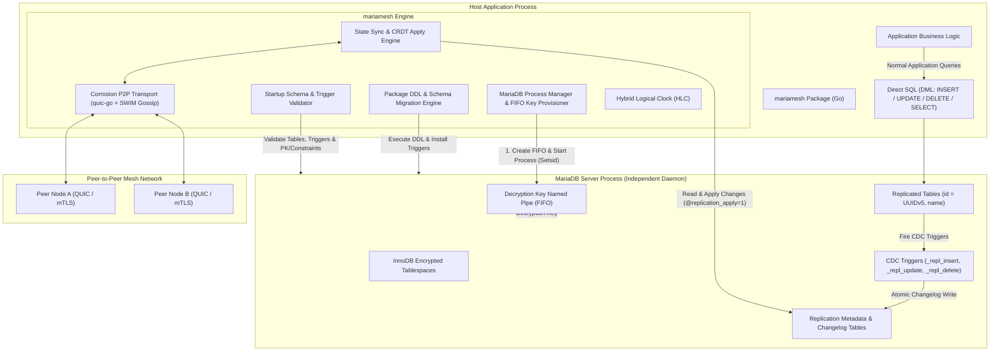
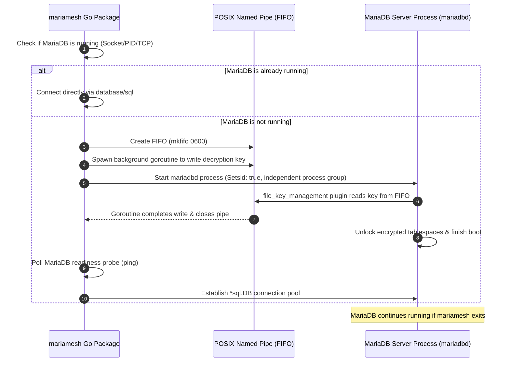
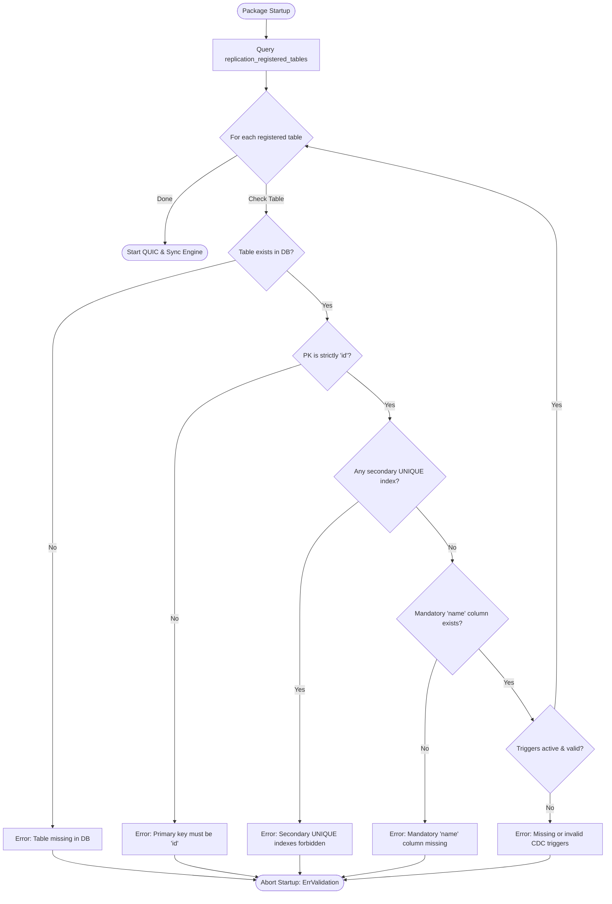
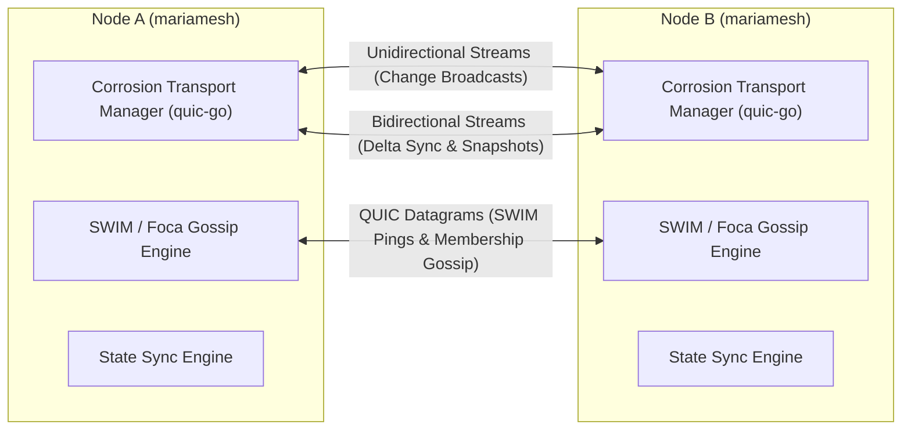

# MARIAMESH: Decentralized Multi-Master Replication for MariaDB

`mariamesh` is an embeddable Go package providing masterless, multi-primary asynchronous database replication across a distributed mesh of MariaDB nodes. It utilizes Conflict-free Replicated Data Type (CRDT) semantics with Hybrid Logical Clock (HLC) per-field Last-Write-Wins (LWW) conflict resolution, transactional trigger-based Change Data Capture (CDC), and a peer-to-peer networking transport ported directly from Superfly's **Corrosion** (`superfly/corrosion`) in Rust to Golang.

---

## Architecture Overview



---

## Core System Principles & Boundaries

### 1. Intercept All Statements: Package Controls DDL, Application Writes Direct SQL (DML)
- **All DDL Schema Changes are Controlled by `mariamesh`**:
  - The package strictly owns, executes, and orchestrates all DDL operations (`CREATE TABLE`, `ALTER TABLE`, `DROP TABLE`, trigger generation/installation, metadata table migrations, and schema version bumps).
  - Out-of-band, manual schema alterations executed directly on MariaDB bypass replication safety and are forbidden. Applications define their schema changes using `mariamesh` DDL APIs or schema migration scripts generated and applied by the package.
- **Direct DML Execution by the Application**:
  - Once tables are created and managed by the package, the host application executes standard DML statements (`INSERT`, `UPDATE`, `DELETE`, `SELECT`, `BEGIN`, `COMMIT`) **directly** against MariaDB using standard `database/sql` connections.
  - No SQL proxy, connection interceptor, or query rewriting layer is placed in front of day-to-day CRUD operations.
- **Transparent Database-Level Statement Interception**:
  - Database-level triggers (`_repl_insert`, `_repl_update`, `_repl_delete`) installed by `mariamesh` automatically intercept local application DML writes inside MariaDB.
  - Triggers extract modified columns into JSON payloads, assign a transactional local sequence number, record HLC timestamps, and append changelog records into `replication_log` atomically within the application's transaction.

### 2. Table Schema Constraints & Identity Contract
Every table configured for replication must satisfy strict structural invariants:
- **No Secondary UNIQUE Indexes**:
  - Replicated tables **must not have any unique index or constraint other than the primary key `id`**.
  - *Rationale*: In an asynchronous multi-master mesh, concurrent writes on independent nodes with identical values for a secondary unique column (e.g. `UNIQUE KEY (email)`) would succeed locally on both nodes, but cause unresolvable constraint collisions during cross-node replication apply. CRDT/LWW multi-master convergence requires that row identity be uniquely and solely determined by the primary key.
- **Mandatory `name` Column**:
  - Every replicated table must contain a `name` column (`VARCHAR(...) NOT NULL`).
- **Deterministic UUIDv5 Primary Key (`id`) Derived from `tablename + column(name)`**:
  - Primary key `id` must be a `BINARY(16)` or `CHAR(36)` / `UUID`.
  - The ID is derived deterministically at insertion time:
    $$\text{id} = \text{UUIDv5}(\text{NamespaceUUID}, \text{lower}(\text{tablename}) + \text{":"} + \text{lower}(\text{name}))$$
  - Once inserted, the `id` is **strictly immutable**. Subsequent updates to the `name` column (e.g. renaming an entity) do not regenerate or alter the `id`.

### 3. MariaDB Process Management & FIFO Encryption Key Handshake
- `mariamesh` controls when MariaDB starts.
- **Startup Detection**: On startup, `mariamesh` checks if MariaDB is already running (via PID check, UNIX socket probe, or TCP health check).
- **FIFO Key Decryption Flow**:
  - If MariaDB is **not running**:
    1. `mariamesh` creates a secure POSIX named pipe (FIFO file, `mkfifo` with permissions `0600`) at a designated path.
    2. Spawns a background goroutine that writes the MariaDB data-at-rest decryption key into the FIFO pipe (for MariaDB's `file_key_management` plugin).
    3. Launches the MariaDB process (`mariadbd` / `mysqld`) as a detached, independent OS process (`Setsid: true` / independent process group).
    4. MariaDB consumes the encryption key from the FIFO on boot, unlocks encrypted tablespaces, and finishes startup.
    5. **Process Persistence**: Because MariaDB is launched as a detached normal OS process, **it continues running independently even if `mariamesh` or the host application goes down or restarts**.
    6. `mariamesh` polls the database connection until MariaDB is fully ready.

### 4. Startup Schema & Replication Validation Engine
- When `mariamesh` starts, it queries the database metadata table (`replication_registered_tables`) to inspect all tables marked for replication.
- For each replicated table, it queries `information_schema` to validate:
  1. Table exists in MariaDB.
  2. Primary key is strictly `id`.
  3. No secondary `UNIQUE` indexes or constraints exist.
  4. Mandatory `name` column exists and is non-null.
  5. Required CDC triggers exist and are active:
     - `<table>_repl_insert`
     - `<table>_repl_update`
     - `<table>_repl_delete`
  6. Trigger logic and column lists match expected metadata checksums.
- **Fail-Fast Error Handling**: If any table violates any rule (missing triggers, missing `name` column, unauthorized unique constraints, or schema drift), `mariamesh` returns `ErrValidation` and **refuses to start**, preventing silent replication failure or data corruption.

### 5. Node-to-Node Communication: Rust Corrosion Architecture Ported to Go
- Instead of reinventing peer-to-peer transport and clustering, `mariamesh` ports the architecture of **Superfly's Corrosion** (`superfly/corrosion`) to Golang:
  - **QUIC Transport (`quic-go`)**: Mirroring Corrosion's Quinn-based asynchronous QUIC stack.
    - Single cached long-lived QUIC connection per peer with TLS 1.3 / mTLS and ALPN `mariamesh-repl/1`.
    - Multiplexed independent streams and datagrams:
      - **Unidirectional Streams**: High-throughput fire-and-forget delta change broadcasts.
      - **Bidirectional Streams**: Interactive version-vector exchange, delta synchronization sessions, and full snapshot seeding.
      - **QUIC Datagrams**: Unreliable lightweight SWIM-style failure detection pings, ACKs, and membership gossip.
    - Connection pooling with automatic reconnect, single-flight retry, backoff, and live RTT measurement.
    - Graceful listener shutdown: refuse new handshakes, drain active streams, flush, and close.
  - **SWIM-based Gossip Membership (Porting Rust `Foca` to Go)**:
    - Decentralized membership with indirect probing, suspicion mechanism, and incarnation numbers.

---

## Database Metadata Schema

The package controls and creates these internal tables in the MariaDB database:

### `replication_registered_tables`
Registry of all tables participating in replication:
```sql
CREATE TABLE IF NOT EXISTS replication_registered_tables (
    table_name VARCHAR(128) PRIMARY KEY,
    id_column VARCHAR(64) NOT NULL DEFAULT 'id',
    name_column VARCHAR(64) NOT NULL DEFAULT 'name',
    schema_version BIGINT UNSIGNED NOT NULL,
    created_at TIMESTAMP NOT NULL DEFAULT CURRENT_TIMESTAMP,
    updated_at TIMESTAMP NOT NULL DEFAULT CURRENT_TIMESTAMP ON UPDATE CURRENT_TIMESTAMP
) ENGINE=InnoDB;
```

### `replication_node`
Tracks cluster nodes and administrative membership epochs:
```sql
CREATE TABLE IF NOT EXISTS replication_node (
    node_id BINARY(16) NOT NULL,
    incarnation_id BINARY(16) NOT NULL,
    name VARCHAR(255) NOT NULL,
    status ENUM('JOINING', 'ACTIVE', 'RETIRED') NOT NULL,
    membership_epoch BIGINT UNSIGNED NOT NULL,
    schema_version BIGINT UNSIGNED NOT NULL,
    joined_at TIMESTAMP NOT NULL DEFAULT CURRENT_TIMESTAMP,
    retired_at TIMESTAMP NULL DEFAULT NULL,
    last_seen TIMESTAMP NOT NULL DEFAULT CURRENT_TIMESTAMP,
    PRIMARY KEY (node_id, incarnation_id)
) ENGINE=InnoDB;
```

### `replication_local_state`
Single-row state maintaining the local node's transactional sequence counter and HLC:
```sql
CREATE TABLE IF NOT EXISTS replication_local_state (
    node_id BINARY(16) PRIMARY KEY,
    incarnation_id BINARY(16) NOT NULL,
    current_seq BIGINT UNSIGNED NOT NULL DEFAULT 0,
    hlc_physical BIGINT UNSIGNED NOT NULL DEFAULT 0,
    hlc_logical INT UNSIGNED NOT NULL DEFAULT 0,
    updated_at TIMESTAMP NOT NULL DEFAULT CURRENT_TIMESTAMP ON UPDATE CURRENT_TIMESTAMP
) ENGINE=InnoDB;
```

### `replication_log`
Immutable changelog containing local and forwarded changes:
```sql
CREATE TABLE IF NOT EXISTS replication_log (
    origin_node_id BINARY(16) NOT NULL,
    origin_incarnation_id BINARY(16) NOT NULL,
    origin_seq BIGINT UNSIGNED NOT NULL,
    change_id BINARY(16) NOT NULL,
    table_name VARCHAR(128) NOT NULL,
    row_id BINARY(16) NOT NULL,
    operation ENUM('INSERT', 'UPDATE', 'DELETE') NOT NULL,
    hlc_physical BIGINT UNSIGNED NOT NULL,
    hlc_logical INT UNSIGNED NOT NULL,
    payload JSON NOT NULL,
    received_at TIMESTAMP NOT NULL DEFAULT CURRENT_TIMESTAMP,
    PRIMARY KEY (origin_node_id, origin_incarnation_id, origin_seq),
    KEY idx_repl_table_row (table_name, row_id),
    KEY idx_repl_received (received_at)
) ENGINE=InnoDB;
```

### `replication_field_version`
Column-level LWW metadata supporting fine-grained conflict resolution:
```sql
CREATE TABLE IF NOT EXISTS replication_field_version (
    table_name VARCHAR(128) NOT NULL,
    row_id BINARY(16) NOT NULL,
    column_name VARCHAR(64) NOT NULL,
    hlc_physical BIGINT UNSIGNED NOT NULL,
    hlc_logical INT UNSIGNED NOT NULL,
    origin_node_id BINARY(16) NOT NULL,
    origin_seq BIGINT UNSIGNED NOT NULL,
    PRIMARY KEY (table_name, row_id, column_name)
) ENGINE=InnoDB;
```

### `replication_tombstone`
Tracks deleted rows to prevent resurrection by offline nodes:
```sql
CREATE TABLE IF NOT EXISTS replication_tombstone (
    table_name VARCHAR(128) NOT NULL,
    row_id BINARY(16) NOT NULL,
    hlc_physical BIGINT UNSIGNED NOT NULL,
    hlc_logical INT UNSIGNED NOT NULL,
    origin_node_id BINARY(16) NOT NULL,
    origin_seq BIGINT UNSIGNED NOT NULL,
    deleted_at TIMESTAMP NOT NULL DEFAULT CURRENT_TIMESTAMP,
    PRIMARY KEY (table_name, row_id)
) ENGINE=InnoDB;
```

### `replication_progress`
Replication vectors representing contiguous acknowledged sequences per origin:
```sql
CREATE TABLE IF NOT EXISTS replication_progress (
    receiver_node_id BINARY(16) NOT NULL,
    receiver_incarnation_id BINARY(16) NOT NULL,
    origin_node_id BINARY(16) NOT NULL,
    origin_incarnation_id BINARY(16) NOT NULL,
    contiguous_seq BIGINT UNSIGNED NOT NULL,
    updated_at TIMESTAMP NOT NULL DEFAULT CURRENT_TIMESTAMP ON UPDATE CURRENT_TIMESTAMP,
    PRIMARY KEY (receiver_node_id, receiver_incarnation_id, origin_node_id, origin_incarnation_id)
) ENGINE=InnoDB;
```

### `replication_bootstrap` & `replication_bootstrap_vector`
Seeding coordination and GC retention pins for new nodes:
```sql
CREATE TABLE IF NOT EXISTS replication_bootstrap (
    bootstrap_id BINARY(16) PRIMARY KEY,
    joining_node_id BINARY(16) NOT NULL,
    joining_incarnation_id BINARY(16) NOT NULL,
    status ENUM('INITIALIZING', 'STREAMING', 'COMPLETED', 'FAILED') NOT NULL,
    schema_version BIGINT UNSIGNED NOT NULL,
    started_at TIMESTAMP NOT NULL DEFAULT CURRENT_TIMESTAMP,
    completed_at TIMESTAMP NULL DEFAULT NULL
) ENGINE=InnoDB;

CREATE TABLE IF NOT EXISTS replication_bootstrap_vector (
    bootstrap_id BINARY(16) NOT NULL,
    origin_node_id BINARY(16) NOT NULL,
    origin_incarnation_id BINARY(16) NOT NULL,
    seed_seq BIGINT UNSIGNED NOT NULL,
    PRIMARY KEY (bootstrap_id, origin_node_id, origin_incarnation_id)
) ENGINE=InnoDB;
```

---

## Trigger Strategy & CDC Execution

### Trigger-Based Change Interception
For each replicated table (e.g. `device`), `mariamesh` generates and manages three triggers:
1. `device_repl_insert`: Captures all initial column values.
2. `device_repl_update`: Performs NULL-safe comparisons (`IF NOT (OLD.col <=> NEW.col)`) and includes only modified columns in the JSON payload.
3. `device_repl_delete`: Emits a tombstone event.

### Transactional Sequence Increment
Triggers atomically increment `replication_local_state.current_seq` inside the application's transaction:
```sql
UPDATE replication_local_state 
SET current_seq = current_seq + 1 
WHERE node_id = @local_node_id;

SELECT current_seq INTO @seq 
FROM replication_local_state 
WHERE node_id = @local_node_id;
```
This guarantees that application row modifications, sequence allocation, and changelog entries commit atomically.

### Avoiding Infinite Loops (`@replication_apply`)
When `mariamesh` applies incoming remote changes, it sets a connection session variable on its dedicated connection:
```sql
SET @replication_apply = 1;
```
All generated triggers begin with:
```sql
IF @replication_apply IS NOT NULL AND @replication_apply = 1 THEN
    -- In apply mode: Do not generate local replication events
    LEAVE trigger_block;
END IF;
```

---

## MariaDB Process Management & Data-at-Rest Encryption



### Key Management Details
- **FIFO Security**: Created with mode `0600` under a protected runtime directory. Open operations use non-blocking/timed writer routines to prevent deadlocks if MariaDB fails to start.
- **MariaDB Configuration**: Configured with `file_key_management` plugin pointing to the FIFO path:
  ```ini
  [mariadb]
  plugin_load_add = file_key_management
  file_key_management_filename = /var/run/mariamesh/key.fifo
  file_key_management_encryption_algorithm = AES_CTR
  encrypt_binlog = ON
  innodb_encrypt_tables = ON
  innodb_encrypt_log = ON
  ```
- **Independent Daemonization**: Spawning via `exec.Command` with `SysProcAttr: &syscall.SysProcAttr{Setsid: true}` detaches the MariaDB process from the parent process group, ensuring MariaDB remains active even if `mariamesh` is stopped or upgraded.

---

## Startup Schema & Replication Validation Engine

When `mariamesh` initializes, it executes a strict read-only validation pass:



### Validation Checklist
1. **Table Existence**: Verified via `information_schema.tables`.
2. **Primary Key Strictness**: Confirmed via `information_schema.table_constraints` that `PRIMARY KEY` is solely the `id` column.
3. **No Secondary Unique Indexes**: Query `information_schema.statistics` for `NON_UNIQUE = 0 AND INDEX_NAME != 'PRIMARY'`. If any exist, fail startup.
4. **Mandatory `name` Column**: Ensure column `name` exists and has `IS_NULLABLE = 'NO'`.
5. **CDC Triggers**: Query `information_schema.triggers` to confirm presence and definition checksums of:
   - `<table>_repl_insert`
   - `<table>_repl_update`
   - `<table>_repl_delete`
6. **Column Compatibility**: Verify that all declared replicated columns exist with compatible data types.

---

## Node-to-Node Communication: Porting Corrosion to Go

`mariamesh` implements the distributed transport architecture of `superfly/corrosion`:



### Transport Layer Specifications
- **Single Cached QUIC Connection Per Peer**: Multiplexes all application traffic over one connection per peer address, automatically handling reconnects with exponential backoff and single-flight retry.
- **TLS 1.3 / mTLS**: Strict mutual certificate authentication binding peer certificates to `node_id`. ALPN is set to `mariamesh-repl/1`.
- **Multiplexed Channels**:
  1. **Unidirectional Streams (`stream_uni`)**: Fire-and-forget push broadcasts for newly committed local change events.
  2. **Bidirectional Streams (`stream_bidi`)**: Request-response delta synchronization sessions (version vector exchange, missing event batch streaming, and ACK pipelines) and full snapshot streaming.
  3. **QUIC Datagrams (`datagram`)**: Unreliable low-latency SWIM membership pings, ACKs, and gossip packets.
- **Framing & Envelopes**: Length-delimited versioned envelopes with namespace verification:
  ```text
  ┌──────────────────┬────────────────────┬──────────────────────────────────────┐
  │ Length (4 Bytes) │ Magic/Version (2B) │ Payload (JSON/Binary Envelope)       │
  └──────────────────┴────────────────────┴──────────────────────────────────────┘
  ```
- **Live RTT Sampling**: Periodically measures QUIC path round-trip times to inform routing, gossip timeouts, and peer selection.
- **Graceful Listener Lifecycle**: Rejects new handshakes, drains active streams, flushes ACK buffers, and shuts down cleanly.

---

## Wire Protocol & State Synchronization

### Message Framing Types
1. `HELLO`: Protocol version, `node_id`, `incarnation_id`, `schema_version`, and `membership_epoch`.
2. `VECTOR`: Map of `{origin_node_id: max_contiguous_seq}`.
3. `BATCH`: Ordered array of changelog entries with origin metadata, HLC, and JSON payload.
4. `ACK`: Map of `{origin_node_id: acknowledged_seq}` sent after local transaction commit.
5. `SEED_START` / `SEED_CHUNK` / `SEED_FINISH`: Consistent snapshot transfer messages.
6. `GOSSIP`: SWIM failure detection and membership propagation.

### Store-and-Forward Propagation
Changes propagate across arbitrary multi-hop topologies:
```text
Node A ──────> Node B ──────> Node C
```
- Node B receives change `(origin: A, seq: 100)` and stores it verbatim in its `replication_log` without altering the origin metadata.
- Node B forwards `(origin: A, seq: 100)` to Node C.
- Deduplication is guaranteed by the composite primary key `(origin_node_id, origin_incarnation_id, origin_seq)`.
- **Commit-Before-ACK**: A node sends an ACK for a batch only **after** the MariaDB transaction successfully commits.

---

## Conflict Resolution: Hybrid Logical Clocks & Column LWW

### Hybrid Logical Clock (HLC)
Every change event is stamped with an HLC tuple:
$$\text{HLC} = (\text{physical\_time\_ms}, \text{logical\_counter}, \text{origin\_node\_id})$$

### Column-Level Last-Write-Wins (LWW)
When applying an incoming change for column $C$ of row $R$:
1. Read existing $(\text{hlc\_physical}, \text{hlc\_logical}, \text{origin\_node\_id})$ from `replication_field_version`.
2. Compare incoming HLC against existing HLC:
   - Higher physical timestamp wins.
   - If physical timestamps are equal, higher logical counter wins.
   - If logical counters are equal, lexicographical comparison of `origin_node_id` breaks ties deterministically.
3. If incoming HLC wins:
   - Apply column update to application table.
   - Update `replication_field_version` with new HLC and origin sequence.
4. If incoming HLC loses:
   - Discard column update.
   - Still record the change event in `replication_log` for store-and-forward routing.

### Tombstones for Deletes
- Row deletions insert a record into `replication_tombstone` with the delete's HLC.
- An incoming update with an HLC older than the tombstone is discarded, preventing resurrection of deleted rows.

---

## Garbage Collection & Snapshot Seeding

### Garbage Collection (GC)
- Active nodes periodically compute the minimum acknowledged sequence across all active cluster members for each origin:
  $$\text{GC\_Watermark}(\text{origin}) = \min_{n \in \text{ACTIVE}} \text{ACK}(n, \text{origin})$$
- Rows in `replication_log` with $\text{origin\_seq} \le \text{GC\_Watermark}(\text{origin})$ are purged in bounded batches.
- Nodes in `RETIRED` state are excluded from the calculation.
- Nodes in `JOINING` state pin GC via their `replication_bootstrap_vector`.

### Full Snapshot Seeding (New Node Join)
1. The joining node connects to a donor node via a bidirectional QUIC stream.
2. The donor starts a consistent InnoDB read transaction (`START TRANSACTION WITH CONSISTENT SNAPSHOT`).
3. The donor records the current replication vector:
   $$V_{\text{seed}} = \{A: 12000, B: 8800, C: 4400\}$$
4. The donor inserts $V_{\text{seed}}$ into `replication_bootstrap_vector` as an active GC retention pin.
5. The donor streams table schemas and row contents in chunks over QUIC.
6. The joining node applies rows with `@replication_apply = 1`.
7. Once snapshot streaming completes, normal delta replication catches up missing events ($> V_{\text{seed}}$).
8. The joining node transitions from `JOINING` to `ACTIVE`.

---

## Internal Package Architecture

```text
mariamesh/
├── config.go                 # Public configuration & validation
├── doc.go                    # Package documentation
├── errors.go                 # Sentinel error definitions
├── identity.go               # Deterministic UUIDv5 generator & validator
├── mariamesh.go              # Public Replicator engine API & lifecycle
├── table.go                  # Table declaration & registry
│
├── internal/
│   ├── changelog/            # Change event definitions & payload encoders
│   ├── clock/                # Hybrid Logical Clock (HLC) implementation
│   ├── conflict/             # Column-level LWW conflict resolution
│   ├── corrosion/
│   │   ├── foca/             # SWIM gossip membership engine (ported from Rust Foca)
│   │   ├── pool/             # Peer QUIC connection pooling & health monitor
│   │   └── transport/        # quic-go transport, framing & multiplexed streams
│   ├── ddl/                  # Package DDL execution & schema migration engine
│   ├── gc/                   # Distributed garbage collection engine
│   ├── process/              # MariaDB process manager & FIFO key handshake
│   ├── schema/               # Startup schema & trigger validation engine
│   ├── seed/                 # Snapshot seeding & bootstrap retention pins
│   ├── store/                # MariaDB metadata store & transaction manager
│   ├── sync/                 # Delta sync sessions & store-and-forward engine
│   └── trigger/              # Trigger SQL generator & installer
```

---

## Public Go API

```go
package replication

import (
    "context"
    "crypto/tls"
    "database/sql"
    "time"

    "github.com/google/uuid"
)

// ProcessConfig controls the MariaDB daemon lifecycle and key handshake.
type ProcessConfig struct {
    AutoStart      bool          // Auto-start MariaDB if not running
    BinaryPath     string        // Path to mariadbd/mysqld binary
    ConfigFile     string        // Path to my.cnf
    SocketPath     string        // Path to UNIX domain socket
    FIFODir        string        // Directory for key FIFO named pipe
    DecryptionKey  []byte        // Encryption key for file_key_management
    StartupTimeout time.Duration // Max time to wait for DB readiness
}

// Config defines the complete replicator configuration.
type Config struct {
    DB            *sql.DB
    Process       ProcessConfig
    NodeID        uuid.UUID
    IncarnationID uuid.UUID
    Namespace     uuid.UUID
    NodeName      string
    SchemaVersion uint64
    ListenAddr    string
    TLSConfig     *tls.Config
    ForwardMode   ForwardMode
    Logger        Logger
}

// Replicator manages the MariaDB process, schema validation, and replication mesh.
type Replicator struct { /* ... */ }

// New creates a new Replicator instance.
func New(cfg Config) (*Replicator, error)

// Start MariaDB (if needed), validates schema, and launches the replication mesh.
func (r *Replicator) Start(ctx context.Context) error

// Close gracefully stops the replication mesh. MariaDB daemon continues running.
func (r *Replicator) Close() error

// CreateTable controls DDL schema creation, installs triggers, and registers replication.
func (r *Replicator) CreateTable(ctx context.Context, table Table) error

// AlterTable controls DDL schema updates and refreshes triggers atomically.
func (r *Replicator) AlterTable(ctx context.Context, table Table, ddlSQL string) error

// Validate verifies that registered tables, columns, PKs, and triggers match requirements.
func (r *Replicator) Validate(ctx context.Context) error

// Cluster membership and peer management.
func (r *Replicator) AddPeer(ctx context.Context, addr string) error
func (r *Replicator) RemovePeer(ctx context.Context, addr string) error
func (r *Replicator) AddNode(ctx context.Context, nodeID uuid.UUID, name string) error
func (r *Replicator) RetireNode(ctx context.Context, nodeID uuid.UUID) error
```

### Host Application Integration Example

```go
package main

import (
    "context"
    "log"
    "github.com/google/uuid"
    "github.com/marcgauthier/mariamesh"
)

func main() {
    ctx := context.Background()
    namespace := uuid.MustParse("e0a5c43d-5f3e-4b92-8db7-658b09332e12")
    nodeID := uuid.New()
    incarnationID := uuid.New()

    r, err := replication.New(replication.Config{
        Process: replication.ProcessConfig{
            AutoStart:     true,
            BinaryPath:    "/usr/sbin/mariadbd",
            ConfigFile:    "/etc/mysql/mariadb.cnf",
            SocketPath:    "/var/run/mysqld/mysqld.sock",
            FIFODir:       "/var/run/mariamesh",
            DecryptionKey: []byte("my-secret-encryption-key-32bytes!"),
        },
        NodeID:        nodeID,
        IncarnationID: incarnationID,
        Namespace:     namespace,
        ListenAddr:    ":7443",
        TLSConfig:     tlsConfig,
    })
    if err != nil {
        log.Fatalf("Failed to initialize replicator: %v", err)
    }

    // Controls DDL creation and installs CDC triggers
    err = r.CreateTable(ctx, replication.Table{
        Name:       "device",
        IDColumn:   "id",
        NameColumn: "name",
        Columns: []replication.Column{
            {Name: "location", Type: "VARCHAR(255)"},
            {Name: "ip_address", Type: "VARCHAR(45)"},
        },
    })
    if err != nil {
        log.Fatalf("DDL creation failed: %v", err)
    }

    // Start launches MariaDB process (if not running), validates schemas & triggers, and starts mesh
    if err := r.Start(ctx); err != nil {
        log.Fatalf("Replication start failed: %v", err)
    }
    defer r.Close()

    // Application performs direct DML SQL queries against MariaDB
    db := r.DB()
    deviceID := replication.ID(namespace, "device", "Router-01")

    _, err = db.ExecContext(ctx, `
        INSERT INTO device (id, name, location, ip_address) 
        VALUES (?, ?, ?, ?)
    `, deviceID, "Router-01", "Ottawa", "192.168.1.1")
    if err != nil {
        log.Fatalf("Direct application insert failed: %v", err)
    }

    select {} // Run service
}
```

---

## Phased Implementation Roadmap

1. **Phase 1: Identity & Schema Contracts**
   - Implement UUIDv5 generation and validation (`identity.go`).
   - Implement `Table` registry, ensuring mandatory `name` column and rejection of secondary unique indexes.
2. **Phase 2: MariaDB Process Manager & FIFO Key Provisioner**
   - Implement MariaDB running detection (PID, UNIX socket, TCP probe).
   - Implement FIFO creation (`mkfifo 0600`) and background key writer goroutine.
   - Implement detached daemon execution (`Setsid: true`) and readiness polling.
3. **Phase 3: Package DDL Engine & Startup Schema Validator**
   - Implement metadata schema creation (`replication_registered_tables`, `replication_log`, etc.).
   - Implement DDL table creation and trigger generator (`_repl_insert`, `_repl_update`, `_repl_delete`).
   - Implement startup validator querying `information_schema` to verify table presence, column definitions, lack of secondary unique indexes, and active trigger definitions.
4. **Phase 4: Local CDC & Apply Engine**
   - Implement transactional local sequence counter (`replication_local_state.current_seq`).
   - Implement `@replication_apply = 1` bypass mechanism.
   - Implement HLC generation, column-level LWW conflict resolution, and tombstone recording.
5. **Phase 5: Corrosion P2P Transport Layer in Go**
   - Port `superfly/corrosion` QUIC transport to `quic-go`.
   - Implement long-lived cached connection pooling per peer with mTLS and ALPN `mariamesh-repl/1`.
   - Implement framing, message envelopes, and multiplexed stream routing (unidirectional broadcasts, bidirectional sync sessions).
   - Implement SWIM-based gossip failure detection and membership engine (porting Rust `Foca` to Go).
6. **Phase 6: Delta State Synchronization**
   - Implement version vector exchange and missing range calculations.
   - Implement bounded batch streaming with commit-before-ACK invariants.
   - Implement multi-hop store-and-forward mesh propagation.
7. **Phase 7: Distributed Garbage Collection**
   - Implement per-origin minimum ACK calculation across active cluster members.
   - Implement bounded changelog pruning and tombstone expiration.
8. **Phase 8: Consistent Snapshot Seeding**
   - Implement InnoDB consistent snapshot streaming for joining nodes.
   - Implement bootstrap retention pins preventing premature GC during snapshot transfer.
   - Implement catch-up delta sync and transition from `JOINING` to `ACTIVE`.
9. **Phase 9: Administrative Membership & Incarnation Management**
   - Implement epoch-based cluster membership transitions.
   - Implement permanent incarnation retirement safeguards.
10. **Phase 10: Production Hardening & Verification**
    - Multi-node partition and convergence testing.
    - Process restart resilience tests (verifying MariaDB continues running across `mariamesh` restarts).
    - Fuzz testing for QUIC message framing and corrupted packet handling.
