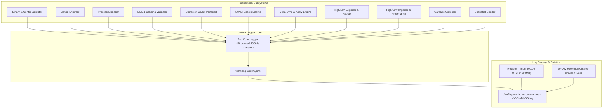

# MARIAMESH: Decentralized Multi-Master & Cross-Domain Replication for MariaDB

`mariamesh` is an embeddable Go package providing masterless, multi-primary asynchronous database replication across a distributed mesh of MariaDB nodes, as well as secure, unidirectional **High/Low Air-Gap Replication** across classified and unclassified security domains. It replaces `GALVANIZE`, utilizing Conflict-free Replicated Data Type (CRDT) semantics with Hybrid Logical Clock (HLC) per-field Last-Write-Wins (LWW) conflict resolution, transactional trigger-based Change Data Capture (CDC), explicit MariaDB binary installation path and configuration file inputs with automated enforcement (data-at-rest encryption, FIFO key handshake, engine invariants), high-performance structured logging with **Zap** and **timberlog** (daily rotation at 00:00 UTC, 30-day retention), and a peer-to-peer networking transport ported directly from Superfly's **Corrosion** (`superfly/corrosion`) in Rust to Golang.

## GALVANIZE Replacement Contract and Open Decisions

The MariaDB replication engine is only one part of a GALVANIZE replacement. Before declaring parity, inventory deployed GALVANIZE configurations, schemas, SQL queries, Go client calls, stored files, High/Low artifacts, and operator workflows. Record for each capability whether MARIAMESH provides a compatible endpoint, a documented migration, or an explicitly accepted removal. The default release gate is that no used capability is silently lost.

| GALVANIZE capability | Required MARIAMESH plan and acceptance criterion |
| --- | --- |
| Application SQL and public API | Provide a MariaDB `database/sql` migration path for the Go client. Decide whether existing PostgreSQL wire and HTTP query/transaction clients need compatibility endpoints; if so, specify supported SQLite-to-MariaDB SQL translation, parameter binding, transaction/error semantics, authentication, and version/watermark responses. Test representative real client queries. Direct MariaDB SQL alone is a breaking client change. |
| Managed schema | Inventory GALVANIZE schema files, views, indexes, primary keys, defaults, and SQL dialect. Define a repeatable conversion into MariaDB migrations, including view/index updates and online schema rollout. The current mandatory `id` UUIDv5 plus `name` rule excludes ordinary GALVANIZE tables with integer, text, or composite primary keys; choose either a compatible identity model or a documented remapping with foreign-reference and client-query migration. Reject unsupported schemas before cutover. |
| Streaming and subscriptions | Provide initial snapshot plus ordered changes, end-of-query watermark, resumable query subscriptions, table updates, retention and slow-consumer policy, and reconnect behavior if existing clients use them. A changelog by itself is not a public subscription API. |
| Encrypted files | Port file upload/download, metadata/search/stats/delete, replicated metadata, encrypted local payloads, peer fetch/cache, and Low-to-High recipient-sealed file transfer. Define key rotation and deletion propagation. Verify files remain readable after migration and remote fetch. |
| Administration and observability | Provide or migrate health/locked status, local admin socket or CLI, remote mTLS admin commands, membership inspection, forced sync, schema reload, backup/restore, key rotation, Prometheus metrics, and the Go client surfaces used by operators. Document endpoint and command changes. |
| Templates and Consul | Inventory use of state-driven Rhai config templates and local Consul service registration. Port the required behavior or provide a tested replacement workflow before retiring GALVANIZE. |
| Network policy | Port peer IP/CIDR allow-list enforcement to inbound and outbound QUIC, gossip, broadcasts, sync, and bootstrap. Test denied peers cannot discover, join, or receive data. |
| High/Low roles and transport | Specify Low, High, and High-replica behavior; directory, HTTP(S), FTP/FTPS, and SFTP transports documented by GALVANIZE; credentials and SFTP host-key pinning; sequence-gap recovery, replay, waiting-schema, and provenance. Verify which adapters work and are deployed: the direct SFTP functions in `crates/galv-highlow/src/transport.rs` currently return a configuration error. Add S3 only as a new adapter with its own tests. |

### Compatibility boundaries that need explicit decisions

- **Mesh protocol:** `mariamesh-repl/1`, MariaDB CDC events, and HLC/LWW metadata do not interoperate with GALVANIZE's Corrosion/CR-SQLite mesh. Plan a one-time export/import or a versioned bridge; do not add MARIAMESH nodes to a live GALVANIZE mesh without a proven bridge.
- **High/Low artifacts:** The existing GALVANIZE `schema_hash` is SHA-256 over ordered `sqlite_schema.sql` entries, excluding internal objects. Hashing MariaDB DDL produces a different value even for equivalent tables. Version the new format or define a canonical cross-database schema and row-value mapping. Claim `galvanize-highlow/1` compatibility only after GALVANIZE-to-MARIAMESH and MARIAMESH-to-GALVANIZE golden-vector tests pass for manifests, signatures, values, keys, deletes, schema holds, replay, and file artifacts.
- **Conflict semantics:** HLC per-field LWW is a new algorithm, not proof of identical CR-SQLite outcomes. Specify tie-breaking, null/blob/JSON encoding, multi-column atomicity, update/delete races, clock skew, and mixed-version behavior; test convergence with the same workloads as GALVANIZE.
- **Secrets and lifecycle:** Define how the MariaDB encryption key, High/Low keys, and TLS material enter memory without being stored in config, source, logs, or process arguments. Specify locked startup/unlock and offline rekey or a documented operational replacement. If attaching to an already-running MariaDB, verify encryption/plugin state before serving traffic. Back up both MariaDB data and external encrypted file payloads and prove restore.
- **Current implementation versus target:** The current Go package takes an existing `*sql.DB`, injects a generic logger, and exposes migration SQL for the host to install. It does not yet implement the planned process manager, package-owned DDL, Zap/timberlog logger, or GALVANIZE-facing services. Resolve ownership of DDL and process startup in the public API and update the examples to match the chosen contract; do not present target design as shipped behavior.

### Migration and release gates

1. Build a fixture from a real GALVANIZE deployment: schema, representative rows and blobs, encrypted files, configuration, clients, and pending High/Low bundles. Record counts and hashes without exposing secrets.
2. Implement an idempotent, resumable export/import with primary-key mapping, SQL type conversion, view/index recreation, file re-encryption, and provenance/High/Low sequence handling. Define a write freeze or dual-write/catch-up cutover, validation, and rollback procedure. Never treat a SQLite database file as a MariaDB data directory.
3. Run equivalent live scenarios on MariaDB: partitions and heal, concurrent updates/deletes, crash recovery, large blobs, peer allow-list, locked startup/rekey, schema drift, High/Low corruption/replay/gaps, file peer fetch and air-gap delivery, and Go client workflows. Compare logical row and file contents across nodes; byte-identical database files are not a meaningful MariaDB criterion.
4. Require an operator-reviewed parity matrix and successful restore and rollback rehearsal before replacing the GALVANIZE service in production.

---

## Architecture Overview

```mermaid
flowchart TD
    subgraph HostApp ["Host Application Process"]
        AppLogic["Application Business Logic"]
        SQLConn["Direct SQL (DML: INSERT / UPDATE / DELETE / SELECT)"]
        MM["mariamesh Package (Go)"]
        
        subgraph MMPkg ["mariamesh Engine"]
            InputVal["Binary Path & Config File Validator"]
            ConfMgr["MariaDB Config Enforcement Engine"]
            ProcMgr["MariaDB Process Manager & FIFO Key Provisioner"]
            DDLMgr["Package DDL & Schema Migration Engine"]
            ValEngine["Startup Schema & Trigger Validator"]
            CorrosionTrans["Corrosion P2P Transport (quic-go + SWIM Gossip)"]
            SyncEngine["State Sync & CRDT Apply Engine"]
            HLCClock["Hybrid Logical Clock (HLC)"]
            Logger["Unified Logger (Zap + timberlog)"]
        end
    end

    subgraph ConfigStorage ["Host Filesystem & OS"]
        MdbBin["MariaDB Server Binary (BinaryPath)"]
        MdbCnf["MariaDB Config File (ConfigFile)"]
        FIFOPipe["Decryption Key Named Pipe (FIFO)"]
        LogFiles["/var/log/mariamesh/mariamesh-YYYY-MM-DD.log"]
    end

    subgraph MariaDBProc ["MariaDB Server Process (Independent Daemon)"]
        InnoDB["InnoDB Encrypted Tablespaces"]
        AppTables["Replicated Tables (id = UUIDv5, name)"]
        Triggers["CDC Triggers (_repl_insert, _repl_update, _repl_delete)"]
        MetaTables["Replication Metadata & Changelog Tables"]
    end

    subgraph Mesh ["Peer-to-Peer Mesh Network"]
        PeerA["Peer Node A (QUIC / mTLS)"]
        PeerB["Peer Node B (QUIC / mTLS)"]
    end

    InputVal -- "1. Validate Binary & Config File Paths" --> MdbBin
    InputVal --> MdbCnf
    ConfMgr -- "2. Enforce Encryption Settings (Edit ConfigFile)" --> MdbCnf
    ProcMgr -- "3. Create FIFO & Start Binary (Setsid)" --> FIFOPipe
    MdbBin -. "Spawn Process" .-> MariaDBProc
    MdbCnf -. "Read Enforced Config" .-> MariaDBProc
    FIFOPipe -- "Decryption Key" --> MariaDBProc
    DDLMgr -- "Execute DDL & Install Triggers" --> MariaDBProc
    ValEngine -- "Validate Tables, Triggers & PK/Constraints" --> MariaDBProc
    AppLogic -- "Normal Application Queries" --> SQLConn
    SQLConn --> AppTables
    AppTables -- "Fire CDC Triggers" --> Triggers
    Triggers -- "Atomic Changelog Write" --> MetaTables
    SyncEngine -- "Read & Apply Changes (@replication_apply=1)" --> MetaTables
    SyncEngine <--> CorrosionTrans
    CorrosionTrans <--> PeerA
    CorrosionTrans <--> PeerB

    ConfMgr -.-> Logger
    ProcMgr -.-> Logger
    DDLMgr -.-> Logger
    ValEngine -.-> Logger
    CorrosionTrans -.-> Logger
    SyncEngine -.-> Logger
    Logger --> LogFiles
```



---

## Core System Principles & Boundaries

### 1. Intercept All Statements: Package Controls DDL, Application Writes Direct SQL (DML)
- **All DDL Schema Changes are Controlled by `mariamesh`**:
  - The package strictly owns, executes, and orchestrates all DDL operations (`CREATE TABLE`, `ALTER TABLE`, `DROP TABLE`, trigger generation/installation, metadata table migrations, and schema version bumps).
  - Out-of-band, manual schema alterations executed directly on MariaDB bypass replication safety and are forbidden. Applications define their schema changes using `mariamesh` DDL APIs or schema migration scripts generated and applied by the package.
- **Direct DML Execution by the Application**:
  - Once tables are created and managed by the package, the host application executes standard DML statements (`INSERT`, `UPDATE`, `DELETE`, `SELECT`, `BEGIN`, `COMMIT`) **directly** against MariaDB using standard `database/sql` connections.
  - No SQL proxy, connection interceptor, or query rewriting layer is placed in front of day-to-day CRUD operations.
- **Transparent Database-Level Statement Interception**:
  - Database-level triggers (`_repl_insert`, `_repl_update`, `_repl_delete`) installed by `mariamesh` automatically intercept local application DML writes inside MariaDB.
  - Triggers extract modified columns into JSON payloads, assign a transactional local sequence number, record HLC timestamps, and append changelog records into `replication_log` (and `replication_highlow_events` if Low role is active) atomically within the application's transaction.

### 2. Table Schema Constraints & Identity Contract
Every table configured for replication must satisfy strict structural invariants:
- **No Secondary UNIQUE Indexes**:
  - Replicated tables **must not have any unique index or constraint other than the primary key `id`**.
  - *Rationale*: In an asynchronous multi-master mesh, concurrent writes on independent nodes with identical values for a secondary unique column (e.g. `UNIQUE KEY (email)`) would succeed locally on both nodes, but cause unresolvable constraint collisions during cross-node replication apply. CRDT/LWW multi-master convergence requires that row identity be uniquely and solely determined by the primary key.
- **Mandatory `name` Column**:
  - Every replicated table must contain a `name` column (`VARCHAR(...) NOT NULL`).
- **Deterministic UUIDv5 Primary Key (`id`) Derived from `tablename + column(name)`**:
  - Primary key `id` must be a `BINARY(16)` or `CHAR(36)` / `UUID`.
  - The ID is derived deterministically at insertion time:
    $$\text{id} = \text{UUIDv5}(\text{NamespaceUUID}, \text{lower}(\text{tablename}) + \text{":"} + \text{lower}(\text{name}))$$
  - Once inserted, the `id` is **strictly immutable**. Subsequent updates to the `name` column (e.g. renaming an entity) do not regenerate or alter the `id`.

### 3. Explicit Binary & Configuration File Input, Auto-Enforcement & Process Management
- **Explicit Installation Path of MariaDB Binary & Config File**:
  - The Go package must be given the explicit filesystem path to the **MariaDB server binary** (`BinaryPath`, e.g. `/usr/sbin/mariadbd`, `/usr/bin/mariadbd`, or custom install location) and its **configuration file** (`ConfigFile`, e.g. `/etc/mysql/mariadb.cnf`, `/etc/my.cnf`).
  - On startup, `mariamesh` validates that `BinaryPath` exists, is a regular file, and is executable.
- **Automated Configuration Enforcement**:
  - `mariamesh` inspects the given configuration file to confirm all mandatory settings (data-at-rest encryption, FIFO key management plugin, InnoDB settings, character encoding, and replication invariants) are properly configured.
  - If any required directive is missing, invalid, or incompatible, `mariamesh` **automatically edits and updates the configuration file** (creating a timestamped backup before writing) to enforce the required settings.
- **MariaDB Process Management & FIFO Key Decryption**:
  - `mariamesh` controls when MariaDB starts. If MariaDB is not running:
    1. Creates a secure POSIX named pipe (FIFO file, `mkfifo` with mode `0600`) at a designated path.
    2. Spawns a background goroutine to write the data-at-rest decryption key into the FIFO pipe for MariaDB's `file_key_management` plugin.
    3. Launches the MariaDB binary (`BinaryPath`) using `ConfigFile` as a detached, independent OS process (`Setsid: true` / independent process group).
    4. MariaDB consumes the key, unlocks tablespaces, and finishes startup.
    5. **Process Persistence**: MariaDB continues running as a normal independent daemon even if `mariamesh` stops or restarts.
    6. `mariamesh` polls the database connection until MariaDB is fully ready.

### 4. Startup Schema & Replication Validation Engine
- When `mariamesh` starts, it queries the database metadata table (`replication_registered_tables`) to inspect all tables marked for replication.
- For each replicated table, it queries `information_schema` to validate:
  1. Table exists in MariaDB.
  2. Primary key is strictly `id`.
  3. No secondary `UNIQUE` indexes or constraints exist.
  4. Mandatory `name` column exists and is non-null.
  5. Required CDC triggers exist and are active:
     - `<table>_repl_insert`
     - `<table>_repl_update`
     - `<table>_repl_delete`
  6. Trigger logic and column lists match expected metadata checksums.
- **Fail-Fast Error Handling**: If any table violates any rule (missing triggers, missing `name` column, unauthorized unique constraints, or schema drift), `mariamesh` returns `ErrValidation` and **refuses to start**, preventing silent replication failure or data corruption.

### 5. Unified Logging with Zap and timberlog (Daily 00:00 UTC Rotation & 30d Retention)
- **Centralized Structured Logger**:
  - Logging is built using Uber's **Zap** (`go.uber.org/zap`) coupled with **`timberlog`** (time-based rolling write syncer).
  - All logs across every internal subsystem (Path Validator, Config Enforcement, Process Manager, DDL Migrations, Schema Validator, Corrosion QUIC Transport, SWIM Gossip, State Sync, CDC Triggers, High/Low Workers, GC, and Seed Snapshots) are routed exclusively to this unified logger.
- **File Rotation & Retention Rules**:
  - **Storage Directory**: Configurable folder (e.g. `/var/log/mariamesh` or configured path).
  - **Daily Rotation at 00:00 UTC (`0000 UTC`)**: Log files rotate exactly at midnight UTC daily.
  - **Default File Size**: Standard maximum file size limit (default `100MB`) triggers size-based rotation if exceeded before midnight.
  - **Retention Policy**: Retains logs for **30 days** (`MaxAge: 30`), automatically pruning expired log files.

### 6. Node-to-Node Communication: Rust Corrosion Architecture Ported to Go
- Instead of reinventing peer-to-peer transport and clustering, `mariamesh` ports the architecture of **Superfly's Corrosion** (`superfly/corrosion`) to Golang:
  - **QUIC Transport (`quic-go`)**: Mirroring Corrosion's Quinn-based asynchronous QUIC stack.
    - Single cached long-lived QUIC connection per peer with TLS 1.3 / mTLS and ALPN `mariamesh-repl/1`.
    - Multiplexed independent streams and datagrams:
      - **Unidirectional Streams**: High-throughput fire-and-forget delta change broadcasts.
      - **Bidirectional Streams**: Interactive version-vector exchange, delta synchronization sessions, and full snapshot seeding.
      - **QUIC Datagrams**: Unreliable lightweight SWIM-style failure detection pings, ACKs, and membership gossip.
    - Connection pooling with automatic reconnect, single-flight retry, backoff, and live RTT measurement.
    - Graceful listener shutdown: refuse new handshakes, drain active streams, flush, and close.
  - **SWIM-based Gossip Membership (Porting Rust `Foca` to Go)**:
    - Decentralized membership with indirect probing, suspicion mechanism, and incarnation numbers.

### 7. High/Low Unidirectional Air-Gap Replication (Cross-Domain Support)
- **GALVANIZE High/Low replacement target**:
  - Target GALVANIZE artifact compatibility for `galvanize-highlow/1`, `galvanize-highlow-sealed/1`, and `galvanize-highlow-manifest/1`, subject to the cross-database schema and value mapping and golden-vector tests above. Otherwise use a new versioned format and migration bridge.
  - Allows lower security domain nodes (e.g. unclassified, branch, or tactical edge) to continuously replicate data to higher security domain nodes (e.g. classified, secret, or central enclaves) across one-way data diodes, file drops, or object storage.
- **Strong Cryptographic Assurance**:
  - Payloads are compressed with `zstd` (level 15) and symmetrically encrypted using `XChaCha20Poly1305` with an ephemeral 256-bit key and 192-bit nonce.
  - The ephemeral key is wrapped using `RSA-OAEP` (SHA-256) with the High recipient's public key.
  - The manifest envelope is cryptographically signed using `Ed25519` by the Low sender.
- **Sparse Merge & High-Ownership Provenance**:
  - On the High node, local modifications to Low-origin rows are tracked in `replication_highlow_provenance`.
  - When subsequent Low updates arrive for that row, High executes a **sparse merge**: updating columns that High has not modified, but strictly **preserving High-owned columns**.
- **Durable Replay & Disaster Recovery**:
  - Low maintains a durable sequence journal (`replication_highlow_events`).
  - High or administrators can trigger replay jobs (`ReplayScope::All` or `ReplayScope::Since(UTC)`) without disrupting scheduled export watermarks.
- **Isolated mTLS Control API**:
  - High and Low expose a dedicated mTLS REST API for status reporting, replay orchestration, and provenance inspection.

---

## MariaDB Binary & Configuration File Input & Auto-Enforcement

```mermaid
flowchart TD
    Start([Package Startup]) --> ValidateInputs[Validate BinaryPath & ConfigFile Inputs]
    
    subgraph InputValidation ["1. Input Verification"]
        ValidateInputs --> CheckBin{BinaryPath exists & executable?}
        CheckBin -- No --> ErrBin[Error: Invalid MariaDB Binary Path]
        CheckBin -- Yes --> CheckCnf{ConfigFile exists or creatable?}
        CheckCnf -- No --> ErrCnf[Error: Invalid Config File Path]
        CheckCnf -- Yes --> ReadINI[Read & Parse ConfigFile (INI)]
    end

    subgraph InspectionEnforcement ["2. Inspection & Auto-Enforcement"]
        ReadINI --> CheckSettings{Are all required settings\npresent and valid in ConfigFile?}
        
        CheckSettings -- Yes --> Verified[Config Verified OK]
        CheckSettings -- No --> BackupConfig[Create Timestamped Backup\nConfigFile.bak.YYYYMMDDHHMMSS]
        BackupConfig --> EditINI[Update/Insert Required Directives under [mariadb]/[mysqld]]
        EditINI --> WriteAtomic[Atomic Temp File Write & Rename (chmod 0644)]
        WriteAtomic --> Reverify[Re-parse and Verify INI]
        Reverify --> Verified
    end

    ErrBin --> FailFast([Abort Startup: ErrConfig])
    ErrCnf --> FailFast
    Verified --> ProcStart[Proceed to MariaDB Process Startup & FIFO Key Handshake]
```

### 1. Mandatory Application Configuration Inputs
The host application must explicitly specify:
- **`ProcessConfig.BinaryPath`**: Absolute path to the MariaDB server binary (e.g. `/usr/sbin/mariadbd`, `/usr/bin/mariadbd`, or `/opt/mariadb/bin/mariadbd`).
- **`ProcessConfig.ConfigFile`**: Absolute path to the MariaDB configuration file (e.g. `/etc/mysql/mariadb.cnf`, `/etc/my.cnf`, or `/opt/mariadb/etc/my.cnf`).

### 2. Mandatory Settings Enforced by `mariamesh`

`mariamesh` inspects the specified `ConfigFile` and automatically enforces the following settings in the `[mariadb]`, `[mysqld]`, or `[server]` sections:

```ini
[mariadb]
# --- 1. Data-at-Rest Encryption (Mandatory) ---
plugin_load_add = file_key_management
file_key_management_filename = /var/run/mariamesh/key.fifo
file_key_management_encryption_algorithm = AES_CTR
innodb_encrypt_tables = ON
innodb_encrypt_log = ON
innodb_encryption_threads = 4
innodb_encryption_rotate_key_age = 1
encrypt_binlog = ON
encrypt_tmp_disk_tables = ON
encrypt_tmp_files = ON

# --- 2. Engine Invariants & Consistency ---
default_storage_engine = InnoDB
character_set_server = utf8mb4
collation_server = utf8mb4_unicode_520_ci
transaction_isolation = READ-COMMITTED

# --- 3. Replication & Performance Invariants ---
binlog_format = ROW
innodb_autoinc_lock_mode = 2
max_allowed_packet = 64M
```

### 3. Safe Configuration File Editing Mechanics
- **Backup Before Modification**: Before any change is made to the specified `ConfigFile`, `mariamesh` creates a backup copy:
  $$\text{ConfigFile} \longrightarrow \text{ConfigFile.bak.}\langle\text{timestamp}\rangle$$
- **Preserve Existing Directives & Comments**: The parser updates existing keys or appends missing keys while preserving all comments and unrelated user configurations.
- **Atomic File Writing**: Writes the updated configuration to a temporary file in the same directory (`.ConfigFile.tmp`), sets permissions (`0644`), and performs an atomic POSIX `rename` over the original file.

---

## MariaDB Process Management & Data-at-Rest Encryption


---

## High/Low Air-Gap Replication Subsystem

### 1. Sealing & Manifest Cryptography

```mermaid
flowchart TD
    subgraph LowSealing ["Low-Side Sealing Pipeline"]
        Events["Batch of Change Events (<= 100,000)"]
        Schema["Compute SHA-256 schema_hash"]
        Bundle["Construct Bundle (JSON Envelope)"]
        Compress["Compress with zstd (Level 15)"]
        GenKey["Generate Ephemeral 256-bit Key & 192-bit Nonce"]
        SymEncrypt["Encrypt Compressed Payload with XChaCha20Poly1305"]
        RSAWrap["Wrap Ephemeral Key with High RSA-OAEP Public Key"]
        PayloadFile["Write *.zstd.galvh Payload"]
        CreateManifest["Construct Manifest (Digests, Key IDs, Filenames)"]
        EdSign["Sign Manifest with Low Ed25519 Private Key"]
        ManifestFile["Write *.json.galv Signed Manifest"]

        Events --> Bundle
        Schema --> Bundle
        Bundle --> Compress
        Compress --> SymEncrypt
        GenKey --> SymEncrypt
        GenKey --> RSAWrap
        SymEncrypt --> PayloadFile
        RSAWrap --> PayloadFile
        PayloadFile --> CreateManifest
        CreateManifest --> EdSign
        EdSign --> ManifestFile
    end

    subgraph HighUnsealing ["High-Side Unsealing Pipeline"]
        FetchPair["Fetch *.json.galv & *.zstd.galvh from Transport"]
        VerifyEd["Verify Low Ed25519 Signature on Manifest"]
        RSADecrypt["Unwrap Ephemeral Key with High RSA Private Key"]
        SymDecrypt["Decrypt Payload with XChaCha20Poly1305"]
        Decompress["Decompress with zstd"]
        VerifySchema["Verify schema_hash against Local MariaDB Schema"]
        ApplyEngine["Apply Events with Provenance Masking"]

        FetchPair --> VerifyEd
        VerifyEd --> RSADecrypt
        RSADecrypt --> SymDecrypt
        SymDecrypt --> Decompress
        Decompress --> VerifySchema
        VerifySchema --> ApplyEngine
    end
```



### Wire Format Constants
- `BUNDLE_FORMAT`: `galvanize-highlow/1`
- `SEALED_FORMAT`: `galvanize-highlow-sealed/1`
- `MANIFEST_FORMAT`: `galvanize-highlow-manifest/1`
- `MAX_MANIFEST_BYTES`: `64 KB`
- `MAX_PAYLOAD_BYTES`: `64 MB`
- `MAX_DECOMPRESSED_BYTES`: `64 MB`
- `MAX_EVENTS_PER_BUNDLE`: `100,000`
- `MAX_VALUE_BYTES`: `4 MB`

### 2. High-Side Sparse Merge & Provenance Protection

When a Low change event is applied on High:

1. **Check Provenance**:
   - Query `replication_highlow_provenance` for `(table_name, primary_key_json)`.
   - Retrieve `high_owned_fields_json` (set of columns previously modified directly on High).
2. **Column Masking**:
   - For an `UPSERT`:
     - Low-provided values are applied to all columns **except** those in `high_owned_fields_json`.
     - High-owned columns retain their current values in MariaDB.
   - For a `DELETE`:
     - If the row has High-owned fields, High may optionally preserve the row as a High-local entity or delete it according to configured domain policy.
3. **Tracking High Overrides**:
   - When an application executes a direct `UPDATE` on High for a row with `low_origin = true`, the database triggers update `replication_highlow_provenance`, appending the modified column names to `high_owned_fields_json` and updating `last_high_override_at_ms`.

---

## Unified Logging Architecture: Zap & timberlog



---

## Complete Database Metadata Schema

```sql
-- 1. Table Registry
CREATE TABLE IF NOT EXISTS replication_registered_tables (
    table_name VARCHAR(128) PRIMARY KEY,
    id_column VARCHAR(64) NOT NULL DEFAULT 'id',
    name_column VARCHAR(64) NOT NULL DEFAULT 'name',
    schema_version BIGINT UNSIGNED NOT NULL,
    created_at TIMESTAMP NOT NULL DEFAULT CURRENT_TIMESTAMP,
    updated_at TIMESTAMP NOT NULL DEFAULT CURRENT_TIMESTAMP ON UPDATE CURRENT_TIMESTAMP
) ENGINE=InnoDB;

-- 2. Cluster Nodes & Membership Epochs
CREATE TABLE IF NOT EXISTS replication_node (
    node_id BINARY(16) NOT NULL,
    incarnation_id BINARY(16) NOT NULL,
    name VARCHAR(255) NOT NULL,
    status ENUM('JOINING', 'ACTIVE', 'RETIRED') NOT NULL,
    membership_epoch BIGINT UNSIGNED NOT NULL,
    schema_version BIGINT UNSIGNED NOT NULL,
    joined_at TIMESTAMP NOT NULL DEFAULT CURRENT_TIMESTAMP,
    retired_at TIMESTAMP NULL DEFAULT NULL,
    last_seen TIMESTAMP NOT NULL DEFAULT CURRENT_TIMESTAMP,
    PRIMARY KEY (node_id, incarnation_id)
) ENGINE=InnoDB;

-- 3. Local Sequence & HLC State
CREATE TABLE IF NOT EXISTS replication_local_state (
    node_id BINARY(16) PRIMARY KEY,
    incarnation_id BINARY(16) NOT NULL,
    current_seq BIGINT UNSIGNED NOT NULL DEFAULT 0,
    hlc_physical BIGINT UNSIGNED NOT NULL DEFAULT 0,
    hlc_logical INT UNSIGNED NOT NULL DEFAULT 0,
    updated_at TIMESTAMP NOT NULL DEFAULT CURRENT_TIMESTAMP ON UPDATE CURRENT_TIMESTAMP
) ENGINE=InnoDB;

-- 4. Changelog Store
CREATE TABLE IF NOT EXISTS replication_log (
    origin_node_id BINARY(16) NOT NULL,
    origin_incarnation_id BINARY(16) NOT NULL,
    origin_seq BIGINT UNSIGNED NOT NULL,
    change_id BINARY(16) NOT NULL,
    table_name VARCHAR(128) NOT NULL,
    row_id BINARY(16) NOT NULL,
    operation ENUM('INSERT', 'UPDATE', 'DELETE') NOT NULL,
    hlc_physical BIGINT UNSIGNED NOT NULL,
    hlc_logical INT UNSIGNED NOT NULL,
    payload JSON NOT NULL,
    received_at TIMESTAMP NOT NULL DEFAULT CURRENT_TIMESTAMP,
    PRIMARY KEY (origin_node_id, origin_incarnation_id, origin_seq),
    KEY idx_repl_table_row (table_name, row_id),
    KEY idx_repl_received (received_at)
) ENGINE=InnoDB;

-- 5. Per-Field Versioning for LWW
CREATE TABLE IF NOT EXISTS replication_field_version (
    table_name VARCHAR(128) NOT NULL,
    row_id BINARY(16) NOT NULL,
    column_name VARCHAR(64) NOT NULL,
    hlc_physical BIGINT UNSIGNED NOT NULL,
    hlc_logical INT UNSIGNED NOT NULL,
    origin_node_id BINARY(16) NOT NULL,
    origin_seq BIGINT UNSIGNED NOT NULL,
    PRIMARY KEY (table_name, row_id, column_name)
) ENGINE=InnoDB;

-- 6. Tombstones for Deletions
CREATE TABLE IF NOT EXISTS replication_tombstone (
    table_name VARCHAR(128) NOT NULL,
    row_id BINARY(16) NOT NULL,
    hlc_physical BIGINT UNSIGNED NOT NULL,
    hlc_logical INT UNSIGNED NOT NULL,
    origin_node_id BINARY(16) NOT NULL,
    origin_seq BIGINT UNSIGNED NOT NULL,
    deleted_at TIMESTAMP NOT NULL DEFAULT CURRENT_TIMESTAMP,
    PRIMARY KEY (table_name, row_id)
) ENGINE=InnoDB;

-- 7. Contiguous Sequence Progress Vectors
CREATE TABLE IF NOT EXISTS replication_progress (
    receiver_node_id BINARY(16) NOT NULL,
    receiver_incarnation_id BINARY(16) NOT NULL,
    origin_node_id BINARY(16) NOT NULL,
    origin_incarnation_id BINARY(16) NOT NULL,
    contiguous_seq BIGINT UNSIGNED NOT NULL,
    updated_at TIMESTAMP NOT NULL DEFAULT CURRENT_TIMESTAMP ON UPDATE CURRENT_TIMESTAMP
) ENGINE=InnoDB;

-- 8. Bootstrap Seeding & GC Retention Pins
CREATE TABLE IF NOT EXISTS replication_bootstrap (
    bootstrap_id BINARY(16) PRIMARY KEY,
    joining_node_id BINARY(16) NOT NULL,
    joining_incarnation_id BINARY(16) NOT NULL,
    status ENUM('INITIALIZING', 'STREAMING', 'COMPLETED', 'FAILED') NOT NULL,
    schema_version BIGINT UNSIGNED NOT NULL,
    started_at TIMESTAMP NOT NULL DEFAULT CURRENT_TIMESTAMP,
    completed_at TIMESTAMP NULL DEFAULT NULL
) ENGINE=InnoDB;

CREATE TABLE IF NOT EXISTS replication_bootstrap_vector (
    bootstrap_id BINARY(16) NOT NULL,
    origin_node_id BINARY(16) NOT NULL,
    origin_incarnation_id BINARY(16) NOT NULL,
    seed_seq BIGINT UNSIGNED NOT NULL,
    PRIMARY KEY (bootstrap_id, origin_node_id, origin_incarnation_id)
) ENGINE=InnoDB;

-- 9. Low-side Persistent Event Journal
CREATE TABLE IF NOT EXISTS replication_highlow_events (
    stream_id VARCHAR(128) NOT NULL,
    sequence BIGINT NOT NULL,
    event_json LONGBLOB NOT NULL,
    committed_at_ms BIGINT NOT NULL DEFAULT 0,
    exported_at_ms BIGINT NULL DEFAULT NULL,
    PRIMARY KEY (stream_id, sequence)
) ENGINE=InnoDB;

-- 10. Low-side Exported Outbox
CREATE TABLE IF NOT EXISTS replication_highlow_outbox (
    bundle_id VARCHAR(64) PRIMARY KEY,
    stream_id VARCHAR(128) NOT NULL,
    sequence_first BIGINT NOT NULL,
    sequence_last BIGINT NOT NULL,
    payload_filename VARCHAR(255) NOT NULL UNIQUE,
    manifest_filename VARCHAR(255) NOT NULL UNIQUE,
    created_at_ms BIGINT NOT NULL,
    uploaded_at_ms BIGINT NULL DEFAULT NULL
) ENGINE=InnoDB;

-- 11. High-side Ingested Inbox
CREATE TABLE IF NOT EXISTS replication_highlow_inbox (
    bundle_id VARCHAR(64) PRIMARY KEY,
    stream_id VARCHAR(128) NOT NULL,
    sequence_first BIGINT NOT NULL,
    sequence_last BIGINT NOT NULL,
    received_at_ms BIGINT NOT NULL,
    status VARCHAR(32) NOT NULL,
    detail TEXT NULL
) ENGINE=InnoDB;

-- 12. High-side Stream Sequence Tracker
CREATE TABLE IF NOT EXISTS replication_highlow_streams (
    stream_id VARCHAR(128) PRIMARY KEY,
    highest_seen_sequence BIGINT NOT NULL DEFAULT 0,
    highest_contiguous_sequence BIGINT NOT NULL DEFAULT 0,
    updated_at_ms BIGINT NOT NULL
) ENGINE=InnoDB;

-- 13. High-side Provenance & Column Override Registry
CREATE TABLE IF NOT EXISTS replication_highlow_provenance (
    table_name VARCHAR(128) NOT NULL,
    primary_key_json VARCHAR(512) NOT NULL,
    stream_id VARCHAR(128) NOT NULL,
    low_first_applied_at_ms BIGINT NOT NULL,
    low_last_applied_at_ms BIGINT NOT NULL,
    last_high_override_at_ms BIGINT NULL DEFAULT NULL,
    high_owned_fields_json TEXT NOT NULL DEFAULT '[]',
    PRIMARY KEY (table_name, primary_key_json)
) ENGINE=InnoDB;

-- 14. Replay Jobs & Execution State (Low-only)
CREATE TABLE IF NOT EXISTS replication_highlow_replay_jobs (
    job_id VARCHAR(64) PRIMARY KEY,
    state VARCHAR(32) NOT NULL,
    scope VARCHAR(32) NOT NULL,
    since_utc VARCHAR(64) NULL,
    end_sequence BIGINT NOT NULL,
    cursor_sequence BIGINT NOT NULL DEFAULT 0,
    total_events BIGINT NOT NULL DEFAULT 0,
    replayed_events BIGINT NOT NULL DEFAULT 0,
    bundle_count BIGINT NOT NULL DEFAULT 0,
    created_at_ms BIGINT NOT NULL,
    started_at_ms BIGINT NULL,
    completed_at_ms BIGINT NULL,
    error TEXT NULL
) ENGINE=InnoDB;

-- 15. Replay Audit Logs (Low-only)
CREATE TABLE IF NOT EXISTS replication_highlow_replay_logs (
    job_id VARCHAR(64) NOT NULL,
    ordinal BIGINT NOT NULL,
    at_ms BIGINT NOT NULL,
    level VARCHAR(16) NOT NULL,
    message TEXT NOT NULL,
    PRIMARY KEY (job_id, ordinal)
) ENGINE=InnoDB;

-- 16. Exporter/Importer Worker Results
CREATE TABLE IF NOT EXISTS replication_highlow_worker_results (
    kind VARCHAR(32) PRIMARY KEY, -- 'export' or 'import'
    state VARCHAR(32) NOT NULL,
    bundle_id VARCHAR(64) NULL,
    stream_id VARCHAR(128) NULL,
    event_count BIGINT NULL,
    updated_at_ms BIGINT NOT NULL,
    error TEXT NULL
) ENGINE=InnoDB;
```

---

## Internal Package Architecture

```text
mariamesh/
├── config.go                 # Public configuration & validation
├── doc.go                    # Package documentation
├── errors.go                 # Sentinel error definitions
├── identity.go               # Deterministic UUIDv5 generator & validator
├── mariamesh.go              # Public Replicator engine API & lifecycle
├── table.go                  # Table declaration & registry
│
├── internal/
│   ├── changelog/            # Change event definitions & payload encoders
│   ├── clock/                # Hybrid Logical Clock (HLC) implementation
│   ├── conflict/             # Column-level LWW conflict resolution
│   ├── corrosion/
│   │   ├── foca/             # SWIM gossip membership engine (ported from Rust Foca)
│   │   ├── pool/             # Peer QUIC connection pooling & health monitor
│   │   └── transport/        # quic-go transport, framing & multiplexed streams
│   ├── ddl/                  # Package DDL execution & schema migration engine
│   ├── gc/                   # Distributed garbage collection engine
│   ├── highlow/              # High/Low Air-Gap Cross-Domain Subsystem
│   │   ├── apply/            # High sparse merge & column masking engine
│   │   ├── bundle/           # Bundle construction, serialization & validation
│   │   ├── control/          # Isolated mTLS REST control API
│   │   ├── crypto/           # Zstd, XChaCha20Poly1305, RSA-OAEP & Ed25519 sealer/unsealer
│   │   ├── provenance/       # High-owned fields & row origin tracking
│   │   ├── replay/           # Low replay worker & job state engine
│   │   ├── transport/        # Directory, HTTP(S), SFTP & S3 cross-domain adapters
│   │   └── worker/           # Background exporter & importer loops
│   ├── logger/               # Unified Zap + timberlog rolling file engine (00:00 UTC, 30d)
│   ├── process/              # MariaDB Process Manager, Config Enforcer & FIFO key handshake
│   │   ├── validate_paths.go   # Validates BinaryPath (executable) and ConfigFile
│   │   ├── config_enforce.go   # Parses INI, updates required settings & writes backup
│   │   ├── daemon.go           # Detached OS process spawning (Setsid) & PID monitoring
│   │   └── fifo.go             # POSIX named pipe key writer goroutine
│   ├── schema/               # Startup schema & trigger validation engine
│   ├── seed/                 # Snapshot seeding & bootstrap retention pins
│   ├── store/                # MariaDB metadata store & transaction manager
│   ├── sync/                 # Delta sync sessions & store-and-forward engine
│   └── trigger/              # Trigger SQL generator & installer
```

---

## Public Go API

```go
package replication

import (
    "context"
    "crypto/tls"
    "database/sql"
    "time"

    "github.com/google/uuid"
    "go.uber.org/zap"
    "go.uber.org/zap/zapcore"
)

// ProcessConfig controls the MariaDB daemon lifecycle, configuration enforcement, and key handshake.
type ProcessConfig struct {
    BinaryPath        string        // Required: Absolute path to mariadbd/mysqld binary (e.g. "/usr/sbin/mariadbd")
    ConfigFile        string        // Required: Absolute path to my.cnf/mariadb.cnf (e.g. "/etc/mysql/mariadb.cnf")
    AutoStart         bool          // Auto-start MariaDB if not running (default: true)
    SocketPath        string        // Path to UNIX domain socket (e.g. "/var/run/mysqld/mysqld.sock")
    FIFODir           string        // Directory for key FIFO named pipe (e.g. "/var/run/mariamesh")
    DecryptionKey     []byte        // Required: Encryption key for file_key_management
    StartupTimeout    time.Duration // Max time to wait for DB readiness (default: 30s)
}

// LogConfig configures the unified Zap + timberlog logger.
type LogConfig struct {
    LogDir      string        // Directory where log files are stored
    MaxSizeMB   int           // Max file size in MB before rotation (default: 100MB)
    MaxAgeDays  int           // Log retention in days (default: 30d)
    RotateUTC   string        // Daily rotation schedule in UTC (default: "00:00")
    Level       zapcore.Level // Minimum log level
    Development bool          // Enable console output alongside file logs
}

// Config defines the complete replicator configuration.
type Config struct {
    DB            *sql.DB
    Process       ProcessConfig
    Logging       LogConfig
    HighLow       HighLowConfig
    NodeID        uuid.UUID
    IncarnationID uuid.UUID
    Namespace     uuid.UUID
    NodeName      string
    SchemaVersion uint64
    ListenAddr    string
    TLSConfig     *tls.Config
    ForwardMode   ForwardMode
}

// Replicator manages the MariaDB process, schema validation, mesh, and High/Low replication.
type Replicator struct { /* ... */ }

// New creates a new Replicator instance.
func New(cfg Config) (*Replicator, error)

// Start initializes config enforcement, MariaDB daemon (if needed), validates schema, and launches workers.
func (r *Replicator) Start(ctx context.Context) error

// Close gracefully stops replication and workers. MariaDB daemon continues running.
func (r *Replicator) Close() error

// Logger returns the unified Zap logger instance used across all subsystems.
func (r *Replicator) Logger() *zap.Logger

// CreateTable controls DDL schema creation, installs triggers, and registers replication.
func (r *Replicator) CreateTable(ctx context.Context, table Table) error

// AlterTable controls DDL schema updates and refreshes triggers atomically.
func (r *Replicator) AlterTable(ctx context.Context, table Table, ddlSQL string) error

// Validate verifies that registered tables, columns, PKs, and triggers match requirements.
func (r *Replicator) Validate(ctx context.Context) error
```

### Host Application Integration Example

```go
package main

import (
    "context"
    "log"
    "github.com/google/uuid"
    "go.uber.org/zap/zapcore"
    "github.com/marcgauthier/mariamesh"
)

func main() {
    ctx := context.Background()
    namespace := uuid.MustParse("e0a5c43d-5f3e-4b92-8db7-658b09332e12")
    nodeID := uuid.New()
    incarnationID := uuid.New()

    r, err := replication.New(replication.Config{
        Process: replication.ProcessConfig{
            // Explicitly specify binary installation path and configuration file
            BinaryPath:    "/usr/sbin/mariadbd",
            ConfigFile:    "/etc/mysql/mariadb.cnf",
            AutoStart:     true,
            SocketPath:    "/var/run/mysqld/mysqld.sock",
            FIFODir:       "/var/run/mariamesh",
            DecryptionKey: decryptionKey, // Loaded from a protected secret source
        },
        Logging: replication.LogConfig{
            LogDir:      "/var/log/mariamesh",
            MaxSizeMB:   100,             // Default 100MB per file
            MaxAgeDays:  30,              // 30-day retention
            RotateUTC:   "00:00",          // Rotate daily at 00:00 UTC
            Level:       zapcore.InfoLevel,
            Development: false,
        },
        NodeID:        nodeID,
        IncarnationID: incarnationID,
        Namespace:     namespace,
        ListenAddr:    ":7443",
        TLSConfig:     tlsConfig,
    })
    if err != nil {
        log.Fatalf("Failed to initialize replicator: %v", err)
    }

    // Controls DDL creation and installs CDC triggers
    err = r.CreateTable(ctx, replication.Table{
        Name:       "device",
        IDColumn:   "id",
        NameColumn: "name",
        Columns: []replication.Column{
            {Name: "location", Type: "VARCHAR(255)"},
            {Name: "ip_address", Type: "VARCHAR(45)"},
        },
    })
    if err != nil {
        log.Fatalf("DDL creation failed: %v", err)
    }

    // Start enforces ConfigFile settings, launches MariaDB BinaryPath (if not running), validates schemas, and starts mesh
    if err := r.Start(ctx); err != nil {
        log.Fatalf("Replication start failed: %v", err)
    }
    defer r.Close()

    // Application performs direct DML SQL queries against MariaDB
    db := r.DB()
    deviceID := replication.ID(namespace, "device", "Router-01")

    _, err = db.ExecContext(ctx, `
        INSERT INTO device (id, name, location, ip_address) 
        VALUES (?, ?, ?, ?)
    `, deviceID, "Router-01", "Ottawa", "192.168.1.1")
    if err != nil {
        log.Fatalf("Direct application insert failed: %v", err)
    }

    select {} // Run service
}
```

---

## Phased Implementation Roadmap

0. **Phase 0: Replacement Inventory and Contract**
   - Inventory deployed GALVANIZE schemas, clients, services, transports, files, and operating procedures; complete the replacement matrix above.
   - Choose the schema/identity migration and High/Low format strategy before locking the MARIAMESH public API and metadata schema.
1. **Phase 1: Identity & Schema Contracts**
   - Implement UUIDv5 generation and validation (`identity.go`).
   - Implement `Table` registry, ensuring mandatory `name` column and rejection of secondary unique indexes.
2. **Phase 2: Unified Zap + timberlog Logging Engine**
   - Implement Zap core integration with `timberlog` rolling write syncer.
   - Configure daily rotation at 00:00 UTC, default 100MB file size, and 30-day retention pruning.
   - Route all package subsystem log emitters into the unified logger.
3. **Phase 3: MariaDB Binary & Config Validation, Enforcement & Process Manager**
   - Implement verification of explicit `ProcessConfig.BinaryPath` (executable file check) and `ProcessConfig.ConfigFile`.
   - Implement INI parsing, backup creation, and automated file editing/enforcement (encryption, FIFO plugin, InnoDB invariants).
   - Implement MariaDB running detection (PID, UNIX socket, TCP probe).
   - Implement FIFO creation (`mkfifo 0600`) and background key writer goroutine.
   - Implement detached daemon execution (`Setsid: true`) and readiness polling.
4. **Phase 4: Package DDL Engine & Startup Schema Validator**
   - Implement metadata schema creation (`replication_registered_tables`, `replication_log`, etc.).
   - Implement DDL table creation and trigger generator (`_repl_insert`, `_repl_update`, `_repl_delete`).
   - Implement startup validator querying `information_schema` to verify table presence, column definitions, lack of secondary unique indexes, and active trigger definitions.
5. **Phase 5: Local CDC & Apply Engine**
   - Implement transactional local sequence counter (`replication_local_state.current_seq`).
   - Implement `@replication_apply = 1` bypass mechanism.
   - Implement HLC generation, column-level LWW conflict resolution, and tombstone recording.
6. **Phase 6: Corrosion P2P Transport Layer in Go**
   - Port `superfly/corrosion` QUIC transport to `quic-go`.
   - Implement long-lived cached connection pooling per peer with mTLS and ALPN `mariamesh-repl/1`.
   - Implement framing, message envelopes, and multiplexed stream routing (unidirectional broadcasts, bidirectional sync sessions).
   - Implement SWIM-based gossip failure detection and membership engine (porting Rust `Foca` to Go).
7. **Phase 7: Delta State Synchronization**
   - Implement version vector exchange and missing range calculations.
   - Implement bounded batch streaming with commit-before-ACK invariants.
   - Implement multi-hop store-and-forward mesh propagation.
8. **Phase 8: High/Low Air-Gap Cryptography & Bundles**
   - Port GALVANIZE bundle construction and validation; resolve the legacy SQLite `schema_hash` mismatch through the versioned mapping and compatibility tests above.
   - Implement Zstd compression, XChaCha20Poly1305 symmetric encryption, RSA-OAEP key wrapping, and Ed25519 manifest signing.
   - Implement and live-test the GALVANIZE transports actually in use: Directory (atomic rename), HTTP(S), FTP/FTPS, and SFTP as applicable; add S3 separately if required.
9. **Phase 9: High/Low Exporter, Importer, Provenance & Replay**
   - Implement Low exporter worker polling `replication_highlow_events` and sealing bundles.
   - Implement High importer worker verifying manifests, unsealing bundles, and recording inbox/stream sequences.
   - Implement High sparse merge engine respecting `replication_highlow_provenance` and High-owned fields.
   - Implement Low replay worker and dedicated mTLS REST control API.
10. **Phase 10: Distributed Garbage Collection & Snapshot Seeding**
    - Implement per-origin minimum ACK calculation across active cluster members.
    - Implement bounded changelog pruning and tombstone expiration.
    - Implement InnoDB consistent snapshot streaming for joining nodes with GC retention pins.
11. **Phase 11: Production Hardening & Verification**
    - Multi-node partition and convergence testing.
    - End-to-end High/Low air-gap ingestion and sparse merge tests.
    - Process restart resilience tests (verifying MariaDB continues running across `mariamesh` restarts).
    - Fuzz testing for QUIC message framing, corrupted packet handling, and bundle unsealing.
12. **Phase 12: GALVANIZE Service Parity and Cutover**
    - Complete the replacement matrix, resolve schema/identity and protocol compatibility decisions, and align the public Go API with actual DDL and process ownership.
    - Implement the client-facing services and operator workflows used by deployed GALVANIZE applications, including subscriptions and encrypted files where inventoried.
    - Build and exercise the export/import bridge, High/Low golden vectors, live parity scenarios, backup/restore, and rollback rehearsal before production cutover.
