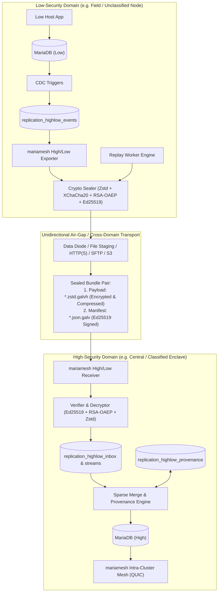
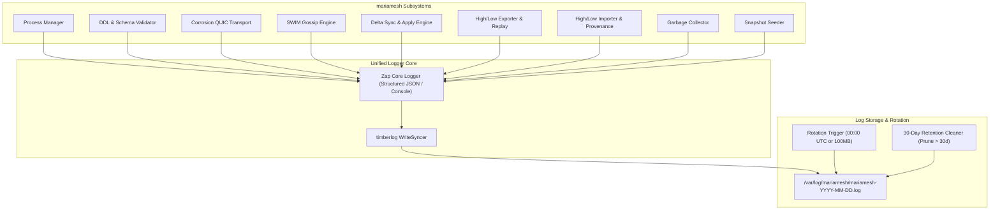
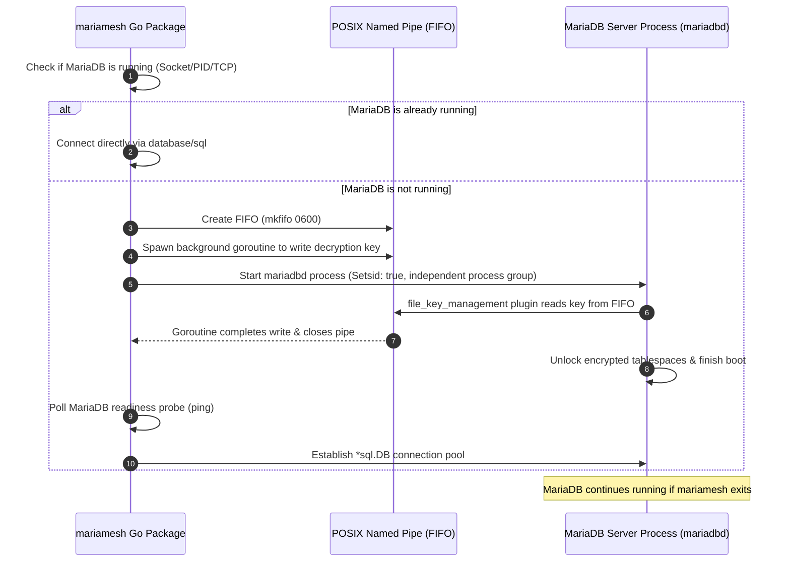
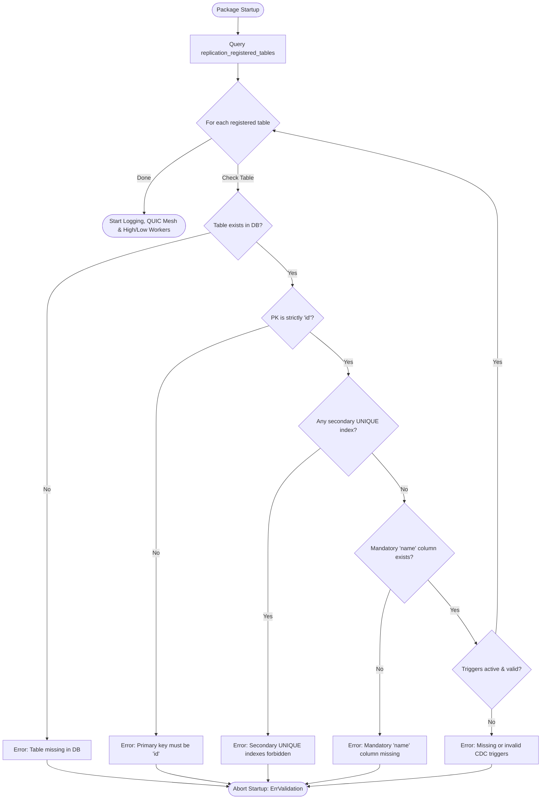
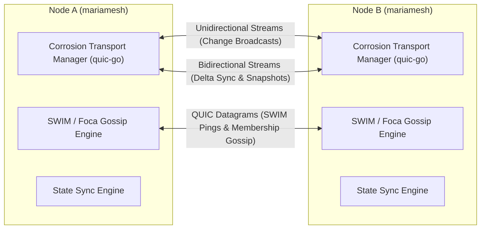

# MARIAMESH: Decentralized Multi-Master & Cross-Domain Replication for MariaDB

`mariamesh` is an embeddable Go package providing masterless, multi-primary asynchronous database replication across a distributed mesh of MariaDB nodes, as well as secure, unidirectional **High/Low Air-Gap Replication** across classified and unclassified security domains. It replaces `GALVANIZE`, utilizing Conflict-free Replicated Data Type (CRDT) semantics with Hybrid Logical Clock (HLC) per-field Last-Write-Wins (LWW) conflict resolution, transactional trigger-based Change Data Capture (CDC), high-performance structured logging with **Zap** and **timberlog** (daily rotation at 00:00 UTC, 30-day retention), and a peer-to-peer networking transport ported directly from Superfly's **Corrosion** (`superfly/corrosion`) in Rust to Golang.

---

## Architecture Overview



---

## Core System Principles & Boundaries

### 1. Intercept All Statements: Package Controls DDL, Application Writes Direct SQL (DML)
- **All DDL Schema Changes are Controlled by `mariamesh`**:
  - The package strictly owns, executes, and orchestrates all DDL operations (`CREATE TABLE`, `ALTER TABLE`, `DROP TABLE`, trigger generation/installation, metadata table migrations, and schema version bumps).
  - Out-of-band, manual schema alterations executed directly on MariaDB bypass replication safety and are forbidden. Applications define their schema changes using `mariamesh` DDL APIs or schema migration scripts generated and applied by the package.
- **Direct DML Execution by the Application**:
  - Once tables are created and managed by the package, the host application executes standard DML statements (`INSERT`, `UPDATE`, `DELETE`, `SELECT`, `BEGIN`, `COMMIT`) **directly** against MariaDB using standard `database/sql` connections.
  - No SQL proxy, connection interceptor, or query rewriting layer is placed in front of day-to-day CRUD operations.
- **Transparent Database-Level Statement Interception**:
  - Database-level triggers (`_repl_insert`, `_repl_update`, `_repl_delete`) installed by `mariamesh` automatically intercept local application DML writes inside MariaDB.
  - Triggers extract modified columns into JSON payloads, assign a transactional local sequence number, record HLC timestamps, and append changelog records into `replication_log` (and `replication_highlow_events` if Low role is active) atomically within the application's transaction.

### 2. Table Schema Constraints & Identity Contract
Every table configured for replication must satisfy strict structural invariants:
- **No Secondary UNIQUE Indexes**:
  - Replicated tables **must not have any unique index or constraint other than the primary key `id`**.
  - *Rationale*: In an asynchronous multi-master mesh, concurrent writes on independent nodes with identical values for a secondary unique column (e.g. `UNIQUE KEY (email)`) would succeed locally on both nodes, but cause unresolvable constraint collisions during cross-node replication apply. CRDT/LWW multi-master convergence requires that row identity be uniquely and solely determined by the primary key.
- **Mandatory `name` Column**:
  - Every replicated table must contain a `name` column (`VARCHAR(...) NOT NULL`).
- **Deterministic UUIDv5 Primary Key (`id`) Derived from `tablename + column(name)`**:
  - Primary key `id` must be a `BINARY(16)` or `CHAR(36)` / `UUID`.
  - The ID is derived deterministically at insertion time:
    $$\text{id} = \text{UUIDv5}(\text{NamespaceUUID}, \text{lower}(\text{tablename}) + \text{":"} + \text{lower}(\text{name}))$$
  - Once inserted, the `id` is **strictly immutable**. Subsequent updates to the `name` column (e.g. renaming an entity) do not regenerate or alter the `id`.

### 3. MariaDB Process Management & FIFO Encryption Key Handshake
- `mariamesh` controls when MariaDB starts.
- **Startup Detection**: On startup, `mariamesh` checks if MariaDB is already running (via PID check, UNIX socket probe, or TCP health check).
- **FIFO Key Decryption Flow**:
  - If MariaDB is **not running**:
    1. `mariamesh` creates a secure POSIX named pipe (FIFO file, `mkfifo` with permissions `0600`) at a designated path.
    2. Spawns a background goroutine that writes the MariaDB data-at-rest decryption key into the FIFO pipe (for MariaDB's `file_key_management` plugin).
    3. Launches the MariaDB process (`mariadbd` / `mysqld`) as a detached, independent OS process (`Setsid: true` / independent process group).
    4. MariaDB consumes the encryption key from the FIFO on boot, unlocks encrypted tablespaces, and finishes startup.
    5. **Process Persistence**: Because MariaDB is launched as a detached normal OS process, **it continues running independently even if `mariamesh` or the host application goes down or restarts**.
    6. `mariamesh` polls the database connection until MariaDB is fully ready.

### 4. Startup Schema & Replication Validation Engine
- When `mariamesh` starts, it queries the database metadata table (`replication_registered_tables`) to inspect all tables marked for replication.
- For each replicated table, it queries `information_schema` to validate:
  1. Table exists in MariaDB.
  2. Primary key is strictly `id`.
  3. No secondary `UNIQUE` indexes or constraints exist.
  4. Mandatory `name` column exists and is non-null.
  5. Required CDC triggers exist and are active:
     - `<table>_repl_insert`
     - `<table>_repl_update`
     - `<table>_repl_delete`
  6. Trigger logic and column lists match expected metadata checksums.
- **Fail-Fast Error Handling**: If any table violates any rule (missing triggers, missing `name` column, unauthorized unique constraints, or schema drift), `mariamesh` returns `ErrValidation` and **refuses to start**, preventing silent replication failure or data corruption.

### 5. Unified Logging with Zap and timberlog (Daily 00:00 UTC Rotation & 30d Retention)
- **Centralized Structured Logger**:
  - Logging is built using Uber's **Zap** (`go.uber.org/zap`) coupled with **`timberlog`** (time-based rolling write syncer).
  - All logs across every internal subsystem (Process Manager, DDL Migrations, Schema Validator, Corrosion QUIC Transport, SWIM Gossip, State Sync, CDC Triggers, High/Low Workers, GC, and Seed Snapshots) are routed exclusively to this unified logger.
- **File Rotation & Retention Rules**:
  - **Storage Directory**: Configurable folder (e.g. `/var/log/mariamesh` or configured path).
  - **Daily Rotation at 00:00 UTC (`0000 UTC`)**: Log files rotate exactly at midnight UTC daily.
  - **Default File Size**: Standard maximum file size limit (default `100MB`) triggers size-based rotation if exceeded before midnight.
  - **Retention Policy**: Retains logs for **30 days** (`MaxAge: 30`), automatically pruning expired log files.

### 6. Node-to-Node Communication: Rust Corrosion Architecture Ported to Go
- Instead of reinventing peer-to-peer transport and clustering, `mariamesh` ports the architecture of **Superfly's Corrosion** (`superfly/corrosion`) to Golang:
  - **QUIC Transport (`quic-go`)**: Mirroring Corrosion's Quinn-based asynchronous QUIC stack.
    - Single cached long-lived QUIC connection per peer with TLS 1.3 / mTLS and ALPN `mariamesh-repl/1`.
    - Multiplexed independent streams and datagrams:
      - **Unidirectional Streams**: High-throughput fire-and-forget delta change broadcasts.
      - **Bidirectional Streams**: Interactive version-vector exchange, delta synchronization sessions, and full snapshot seeding.
      - **QUIC Datagrams**: Unreliable lightweight SWIM-style failure detection pings, ACKs, and membership gossip.
    - Connection pooling with automatic reconnect, single-flight retry, backoff, and live RTT measurement.
    - Graceful listener shutdown: refuse new handshakes, drain active streams, flush, and close.
  - **SWIM-based Gossip Membership (Porting Rust `Foca` to Go)**:
    - Decentralized membership with indirect probing, suspicion mechanism, and incarnation numbers.

### 7. High/Low Unidirectional Air-Gap Replication (Cross-Domain Support)
- **Full Replacement for Galvanize High/Low**:
  - Implements complete wire-compatible support for Galvanize High/Low air-gap replication (`galvanize-highlow/1`, `galvanize-highlow-sealed/1`, `galvanize-highlow-manifest/1`).
  - Allows lower security domain nodes (e.g. unclassified, branch, or tactical edge) to continuously replicate data to higher security domain nodes (e.g. classified, secret, or central enclaves) across one-way data diodes, file drops, or object storage.
- **Strong Cryptographic Assurance**:
  - Payloads are compressed with `zstd` (level 15) and symmetrically encrypted using `XChaCha20Poly1305` with an ephemeral 256-bit key and 192-bit nonce.
  - The ephemeral key is wrapped using `RSA-OAEP` (SHA-256) with the High recipient's public key.
  - The manifest envelope is cryptographically signed using `Ed25519` by the Low sender.
- **Sparse Merge & High-Ownership Provenance**:
  - On the High node, local modifications to Low-origin rows are tracked in `replication_highlow_provenance`.
  - When subsequent Low updates arrive for that row, High executes a **sparse merge**: updating columns that High has not modified, but strictly **preserving High-owned columns**.
- **Durable Replay & Disaster Recovery**:
  - Low maintains a durable sequence journal (`replication_highlow_events`).
  - High or administrators can trigger replay jobs (`ReplayScope::All` or `ReplayScope::Since(UTC)`) without disrupting scheduled export watermarks.
- **Isolated mTLS Control API**:
  - High and Low expose a dedicated mTLS REST API for status reporting, replay orchestration, and provenance inspection.

---

## High/Low Air-Gap Replication Subsystem

### 1. Sealing & Manifest Cryptography

```mermaid
flowchart TD
    subgraph LowSealing ["Low-Side Sealing Pipeline"]
        Events["Batch of Change Events (<= 100,000)"]
        Schema["Compute SHA-256 schema_hash"]
        Bundle["Construct Bundle (JSON Envelope)"]
        Compress["Compress with zstd (Level 15)"]
        GenKey["Generate Ephemeral 256-bit Key & 192-bit Nonce"]
        SymEncrypt["Encrypt Compressed Payload with XChaCha20Poly1305"]
        RSAWrap["Wrap Ephemeral Key with High RSA-OAEP Public Key"]
        PayloadFile["Write *.zstd.galvh Payload"]
        CreateManifest["Construct Manifest (Digests, Key IDs, Filenames)"]
        EdSign["Sign Manifest with Low Ed25519 Private Key"]
        ManifestFile["Write *.json.galv Signed Manifest"]

        Events --> Bundle
        Schema --> Bundle
        Bundle --> Compress
        Compress --> SymEncrypt
        GenKey --> SymEncrypt
        GenKey --> RSAWrap
        SymEncrypt --> PayloadFile
        RSAWrap --> PayloadFile
        PayloadFile --> CreateManifest
        CreateManifest --> EdSign
        EdSign --> ManifestFile
    end

    subgraph HighUnsealing ["High-Side Unsealing Pipeline"]
        FetchPair["Fetch *.json.galv & *.zstd.galvh from Transport"]
        VerifyEd["Verify Low Ed25519 Signature on Manifest"]
        RSADecrypt["Unwrap Ephemeral Key with High RSA Private Key"]
        SymDecrypt["Decrypt Payload with XChaCha20Poly1305"]
        Decompress["Decompress with zstd"]
        VerifySchema["Verify schema_hash against Local MariaDB Schema"]
        ApplyEngine["Apply Events with Provenance Masking"]

        FetchPair --> VerifyEd
        VerifyEd --> RSADecrypt
        RSADecrypt --> SymDecrypt
        SymDecrypt --> Decompress
        Decompress --> VerifySchema
        VerifySchema --> ApplyEngine
    end
```



### Wire Format Constants
- `BUNDLE_FORMAT`: `galvanize-highlow/1`
- `SEALED_FORMAT`: `galvanize-highlow-sealed/1`
- `MANIFEST_FORMAT`: `galvanize-highlow-manifest/1`
- `MAX_MANIFEST_BYTES`: `64 KB`
- `MAX_PAYLOAD_BYTES`: `64 MB`
- `MAX_DECOMPRESSED_BYTES`: `64 MB`
- `MAX_EVENTS_PER_BUNDLE`: `100,000`
- `MAX_VALUE_BYTES`: `4 MB`

### 2. High-Side Sparse Merge & Provenance Protection

When a Low change event is applied on High:

1. **Check Provenance**:
   - Query `replication_highlow_provenance` for `(table_name, primary_key_json)`.
   - Retrieve `high_owned_fields_json` (set of columns previously modified directly on High).
2. **Column Masking**:
   - For an `UPSERT`:
     - Low-provided values are applied to all columns **except** those in `high_owned_fields_json`.
     - High-owned columns retain their current values in MariaDB.
   - For a `DELETE`:
     - If the row has High-owned fields, High may optionally preserve the row as a High-local entity or delete it according to configured domain policy.
3. **Tracking High Overrides**:
   - When an application executes a direct `UPDATE` on High for a row with `low_origin = true`, the database triggers update `replication_highlow_provenance`, appending the modified column names to `high_owned_fields_json` and updating `last_high_override_at_ms`.

### 3. Transport Adapters
`mariamesh` provides modular, robust transport adapters for cross-domain transfer:

| Transport Kind | Usage / Air-Gap Compatibility | Key Mechanics |
| :--- | :--- | :--- |
| **Directory / Filesystem** | Local shared storage, USB/optical media drops, unidirectional data diodes | Writes to `.partial` temp file first, then executes atomic filesystem rename. |
| **HTTP / HTTPS** | Networked cross-domain proxies or REST upload servers | HTTP `PUT` / `POST` with Bearer token or mTLS authentication. |
| **SFTP / FTPS / FTP** | Legacy secure file transfer gateways | SSH key / password authenticated remote file staging. |
| **S3 / Object Store** | Cloud or on-prem S3-compatible buckets (AWS, MinIO) | Multipart / single PUT with MD5 checksum verification. |

### 4. Dedicated mTLS Control API
Low and High nodes run an isolated, lightweight HTTP server protected by mutual TLS (client and server certificates validated against configured CAs):

- `GET /v1/highlow/status`: Returns current worker state (`running`, `idle`), pending unexported event count, latest export result, latest import result, and active replay job summary.
- `POST /v1/highlow/replay`: (Low-only) Enqueues an asynchronous historical replay job.
  - Body: `{"scope": "all"}` or `{"scope": "since", "since_utc": "2026-09-20T00:00:00Z"}`.
- `GET /v1/highlow/replay/status`: (Low-only) Returns the current active replay job and the latest 200 audit log entries.
- `POST /v1/highlow/provenance`: (High-only) Accepts a list of `{table, primary_key}` pairs and returns their origin status (`low_origin: true/false`), stream ID, and `high_owned_fields`.

---

## Unified Logging Architecture: Zap & timberlog



---

## Complete Database Metadata Schema

The package controls and creates these internal tables in MariaDB:

### Intra-Mesh Core Replication Tables

```sql
-- 1. Table Registry
CREATE TABLE IF NOT EXISTS replication_registered_tables (
    table_name VARCHAR(128) PRIMARY KEY,
    id_column VARCHAR(64) NOT NULL DEFAULT 'id',
    name_column VARCHAR(64) NOT NULL DEFAULT 'name',
    schema_version BIGINT UNSIGNED NOT NULL,
    created_at TIMESTAMP NOT NULL DEFAULT CURRENT_TIMESTAMP,
    updated_at TIMESTAMP NOT NULL DEFAULT CURRENT_TIMESTAMP ON UPDATE CURRENT_TIMESTAMP
) ENGINE=InnoDB;

-- 2. Cluster Nodes & Membership Epochs
CREATE TABLE IF NOT EXISTS replication_node (
    node_id BINARY(16) NOT NULL,
    incarnation_id BINARY(16) NOT NULL,
    name VARCHAR(255) NOT NULL,
    status ENUM('JOINING', 'ACTIVE', 'RETIRED') NOT NULL,
    membership_epoch BIGINT UNSIGNED NOT NULL,
    schema_version BIGINT UNSIGNED NOT NULL,
    joined_at TIMESTAMP NOT NULL DEFAULT CURRENT_TIMESTAMP,
    retired_at TIMESTAMP NULL DEFAULT NULL,
    last_seen TIMESTAMP NOT NULL DEFAULT CURRENT_TIMESTAMP,
    PRIMARY KEY (node_id, incarnation_id)
) ENGINE=InnoDB;

-- 3. Local Sequence & HLC State
CREATE TABLE IF NOT EXISTS replication_local_state (
    node_id BINARY(16) PRIMARY KEY,
    incarnation_id BINARY(16) NOT NULL,
    current_seq BIGINT UNSIGNED NOT NULL DEFAULT 0,
    hlc_physical BIGINT UNSIGNED NOT NULL DEFAULT 0,
    hlc_logical INT UNSIGNED NOT NULL DEFAULT 0,
    updated_at TIMESTAMP NOT NULL DEFAULT CURRENT_TIMESTAMP ON UPDATE CURRENT_TIMESTAMP
) ENGINE=InnoDB;

-- 4. Changelog Store
CREATE TABLE IF NOT EXISTS replication_log (
    origin_node_id BINARY(16) NOT NULL,
    origin_incarnation_id BINARY(16) NOT NULL,
    origin_seq BIGINT UNSIGNED NOT NULL,
    change_id BINARY(16) NOT NULL,
    table_name VARCHAR(128) NOT NULL,
    row_id BINARY(16) NOT NULL,
    operation ENUM('INSERT', 'UPDATE', 'DELETE') NOT NULL,
    hlc_physical BIGINT UNSIGNED NOT NULL,
    hlc_logical INT UNSIGNED NOT NULL,
    payload JSON NOT NULL,
    received_at TIMESTAMP NOT NULL DEFAULT CURRENT_TIMESTAMP,
    PRIMARY KEY (origin_node_id, origin_incarnation_id, origin_seq),
    KEY idx_repl_table_row (table_name, row_id),
    KEY idx_repl_received (received_at)
) ENGINE=InnoDB;

-- 5. Per-Field Versioning for LWW
CREATE TABLE IF NOT EXISTS replication_field_version (
    table_name VARCHAR(128) NOT NULL,
    row_id BINARY(16) NOT NULL,
    column_name VARCHAR(64) NOT NULL,
    hlc_physical BIGINT UNSIGNED NOT NULL,
    hlc_logical INT UNSIGNED NOT NULL,
    origin_node_id BINARY(16) NOT NULL,
    origin_seq BIGINT UNSIGNED NOT NULL,
    PRIMARY KEY (table_name, row_id, column_name)
) ENGINE=InnoDB;

-- 6. Tombstones for Deletions
CREATE TABLE IF NOT EXISTS replication_tombstone (
    table_name VARCHAR(128) NOT NULL,
    row_id BINARY(16) NOT NULL,
    hlc_physical BIGINT UNSIGNED NOT NULL,
    hlc_logical INT UNSIGNED NOT NULL,
    origin_node_id BINARY(16) NOT NULL,
    origin_seq BIGINT UNSIGNED NOT NULL,
    deleted_at TIMESTAMP NOT NULL DEFAULT CURRENT_TIMESTAMP,
    PRIMARY KEY (table_name, row_id)
) ENGINE=InnoDB;

-- 7. Contiguous Sequence Progress Vectors
CREATE TABLE IF NOT EXISTS replication_progress (
    receiver_node_id BINARY(16) NOT NULL,
    receiver_incarnation_id BINARY(16) NOT NULL,
    origin_node_id BINARY(16) NOT NULL,
    origin_incarnation_id BINARY(16) NOT NULL,
    contiguous_seq BIGINT UNSIGNED NOT NULL,
    updated_at TIMESTAMP NOT NULL DEFAULT CURRENT_TIMESTAMP ON UPDATE CURRENT_TIMESTAMP,
    PRIMARY KEY (receiver_node_id, receiver_incarnation_id, origin_node_id, origin_incarnation_id)
) ENGINE=InnoDB;

-- 8. Bootstrap Seeding & GC Retention Pins
CREATE TABLE IF NOT EXISTS replication_bootstrap (
    bootstrap_id BINARY(16) PRIMARY KEY,
    joining_node_id BINARY(16) NOT NULL,
    joining_incarnation_id BINARY(16) NOT NULL,
    status ENUM('INITIALIZING', 'STREAMING', 'COMPLETED', 'FAILED') NOT NULL,
    schema_version BIGINT UNSIGNED NOT NULL,
    started_at TIMESTAMP NOT NULL DEFAULT CURRENT_TIMESTAMP,
    completed_at TIMESTAMP NULL DEFAULT NULL
) ENGINE=InnoDB;

CREATE TABLE IF NOT EXISTS replication_bootstrap_vector (
    bootstrap_id BINARY(16) NOT NULL,
    origin_node_id BINARY(16) NOT NULL,
    origin_incarnation_id BINARY(16) NOT NULL,
    seed_seq BIGINT UNSIGNED NOT NULL,
    PRIMARY KEY (bootstrap_id, origin_node_id, origin_incarnation_id)
) ENGINE=InnoDB;
```

### High/Low Air-Gap Replication Tables

```sql
-- 9. Low-side Persistent Event Journal
CREATE TABLE IF NOT EXISTS replication_highlow_events (
    stream_id VARCHAR(128) NOT NULL,
    sequence BIGINT NOT NULL,
    event_json LONGBLOB NOT NULL,
    committed_at_ms BIGINT NOT NULL DEFAULT 0,
    exported_at_ms BIGINT NULL DEFAULT NULL,
    PRIMARY KEY (stream_id, sequence)
) ENGINE=InnoDB;

-- 10. Low-side Exported Outbox
CREATE TABLE IF NOT EXISTS replication_highlow_outbox (
    bundle_id VARCHAR(64) PRIMARY KEY,
    stream_id VARCHAR(128) NOT NULL,
    sequence_first BIGINT NOT NULL,
    sequence_last BIGINT NOT NULL,
    payload_filename VARCHAR(255) NOT NULL UNIQUE,
    manifest_filename VARCHAR(255) NOT NULL UNIQUE,
    created_at_ms BIGINT NOT NULL,
    uploaded_at_ms BIGINT NULL DEFAULT NULL
) ENGINE=InnoDB;

-- 11. High-side Ingested Inbox
CREATE TABLE IF NOT EXISTS replication_highlow_inbox (
    bundle_id VARCHAR(64) PRIMARY KEY,
    stream_id VARCHAR(128) NOT NULL,
    sequence_first BIGINT NOT NULL,
    sequence_last BIGINT NOT NULL,
    received_at_ms BIGINT NOT NULL,
    status VARCHAR(32) NOT NULL,
    detail TEXT NULL
) ENGINE=InnoDB;

-- 12. High-side Stream Sequence Tracker
CREATE TABLE IF NOT EXISTS replication_highlow_streams (
    stream_id VARCHAR(128) PRIMARY KEY,
    highest_seen_sequence BIGINT NOT NULL DEFAULT 0,
    highest_contiguous_sequence BIGINT NOT NULL DEFAULT 0,
    updated_at_ms BIGINT NOT NULL
) ENGINE=InnoDB;

-- 13. High-side Provenance & Column Override Registry
CREATE TABLE IF NOT EXISTS replication_highlow_provenance (
    table_name VARCHAR(128) NOT NULL,
    primary_key_json VARCHAR(512) NOT NULL,
    stream_id VARCHAR(128) NOT NULL,
    low_first_applied_at_ms BIGINT NOT NULL,
    low_last_applied_at_ms BIGINT NOT NULL,
    last_high_override_at_ms BIGINT NULL DEFAULT NULL,
    high_owned_fields_json TEXT NOT NULL DEFAULT '[]',
    PRIMARY KEY (table_name, primary_key_json)
) ENGINE=InnoDB;

-- 14. Replay Jobs & Execution State (Low-only)
CREATE TABLE IF NOT EXISTS replication_highlow_replay_jobs (
    job_id VARCHAR(64) PRIMARY KEY,
    state VARCHAR(32) NOT NULL,
    scope VARCHAR(32) NOT NULL,
    since_utc VARCHAR(64) NULL,
    end_sequence BIGINT NOT NULL,
    cursor_sequence BIGINT NOT NULL DEFAULT 0,
    total_events BIGINT NOT NULL DEFAULT 0,
    replayed_events BIGINT NOT NULL DEFAULT 0,
    bundle_count BIGINT NOT NULL DEFAULT 0,
    created_at_ms BIGINT NOT NULL,
    started_at_ms BIGINT NULL,
    completed_at_ms BIGINT NULL,
    error TEXT NULL
) ENGINE=InnoDB;

-- 15. Replay Audit Logs (Low-only)
CREATE TABLE IF NOT EXISTS replication_highlow_replay_logs (
    job_id VARCHAR(64) NOT NULL,
    ordinal BIGINT NOT NULL,
    at_ms BIGINT NOT NULL,
    level VARCHAR(16) NOT NULL,
    message TEXT NOT NULL,
    PRIMARY KEY (job_id, ordinal)
) ENGINE=InnoDB;

-- 16. Exporter/Importer Worker Results
CREATE TABLE IF NOT EXISTS replication_highlow_worker_results (
    kind VARCHAR(32) PRIMARY KEY, -- 'export' or 'import'
    state VARCHAR(32) NOT NULL,
    bundle_id VARCHAR(64) NULL,
    stream_id VARCHAR(128) NULL,
    event_count BIGINT NULL,
    updated_at_ms BIGINT NOT NULL,
    error TEXT NULL
) ENGINE=InnoDB;
```

---

## Trigger Strategy & CDC Execution

### Trigger-Based Change Interception
For each replicated table (e.g. `device`), `mariamesh` generates and manages three triggers:
1. `device_repl_insert`: Captures all initial column values.
2. `device_repl_update`: Performs NULL-safe comparisons (`IF NOT (OLD.col <=> NEW.col)`) and includes only modified columns in the JSON payload.
3. `device_repl_delete`: Emits a tombstone event.

### Transactional Sequence & High/Low Journaling
Triggers atomically increment `replication_local_state.current_seq` and record into both `replication_log` and `replication_highlow_events` (if Low role is active) inside the application's transaction:
```sql
UPDATE replication_local_state 
SET current_seq = current_seq + 1 
WHERE node_id = @local_node_id;

SELECT current_seq INTO @seq 
FROM replication_local_state 
WHERE node_id = @local_node_id;
```

### Avoiding Infinite Loops (`@replication_apply`)
When `mariamesh` applies incoming remote changes (from either the intra-mesh QUIC sync or High/Low bundle ingestion), it sets a connection session variable on its dedicated connection:
```sql
SET @replication_apply = 1;
```
All generated triggers begin with:
```sql
IF @replication_apply IS NOT NULL AND @replication_apply = 1 THEN
    -- In apply mode: Do not generate local replication events
    LEAVE trigger_block;
END IF;
```

---

## MariaDB Process Management & Data-at-Rest Encryption



---

## Startup Schema & Replication Validation Engine

When `mariamesh` initializes, it executes a strict read-only validation pass:



---

## Node-to-Node Communication: Porting Corrosion to Go

`mariamesh` implements the distributed transport architecture of `superfly/corrosion`:



### Transport Layer Specifications
- **Single Cached QUIC Connection Per Peer**: Multiplexes all application traffic over one connection per peer address, automatically handling reconnects with exponential backoff and single-flight retry.
- **TLS 1.3 / mTLS**: Strict mutual certificate authentication binding peer certificates to `node_id`. ALPN is set to `mariamesh-repl/1`.
- **Multiplexed Channels**:
  1. **Unidirectional Streams (`stream_uni`)**: Fire-and-forget push broadcasts for newly committed local change events.
  2. **Bidirectional Streams (`stream_bidi`)**: Request-response delta synchronization sessions (version vector exchange, missing event batch streaming, and ACK pipelines) and full snapshot streaming.
  3. **QUIC Datagrams (`datagram`)**: Unreliable low-latency SWIM membership pings, ACKs, and gossip packets.
- **Framing & Envelopes**: Length-delimited versioned envelopes with namespace verification:
  ```text
  ┌──────────────────┬────────────────────┬──────────────────────────────────────┐
  │ Length (4 Bytes) │ Magic/Version (2B) │ Payload (JSON/Binary Envelope)       │
  └──────────────────┴────────────────────┴──────────────────────────────────────┘
  ```
- **Live RTT Sampling**: Periodically measures QUIC path round-trip times to inform routing, gossip timeouts, and peer selection.
- **Graceful Listener Lifecycle**: Rejects new handshakes, drains active streams, flushes ACK buffers, and shuts down cleanly.

---

## Conflict Resolution: Hybrid Logical Clocks & Column LWW

### Hybrid Logical Clock (HLC)
Every change event is stamped with an HLC tuple:
$$\text{HLC} = (\text{physical\_time\_ms}, \text{logical\_counter}, \text{origin\_node\_id})$$

### Column-Level Last-Write-Wins (LWW)
When applying an incoming change for column $C$ of row $R$:
1. Read existing $(\text{hlc\_physical}, \text{hlc\_logical}, \text{origin\_node\_id})$ from `replication_field_version`.
2. Compare incoming HLC against existing HLC:
   - Higher physical timestamp wins.
   - If physical timestamps are equal, higher logical counter wins.
   - If logical counters are equal, lexicographical comparison of `origin_node_id` breaks ties deterministically.
3. If incoming HLC wins:
   - Apply column update to application table.
   - Update `replication_field_version` with new HLC and origin sequence.
4. If incoming HLC loses:
   - Discard column update.
   - Still record the change event in `replication_log` for store-and-forward routing.

---

## Internal Package Architecture

```text
mariamesh/
├── config.go                 # Public configuration & validation
├── doc.go                    # Package documentation
├── errors.go                 # Sentinel error definitions
├── identity.go               # Deterministic UUIDv5 generator & validator
├── mariamesh.go              # Public Replicator engine API & lifecycle
├── table.go                  # Table declaration & registry
│
├── internal/
│   ├── changelog/            # Change event definitions & payload encoders
│   ├── clock/                # Hybrid Logical Clock (HLC) implementation
│   ├── conflict/             # Column-level LWW conflict resolution
│   ├── corrosion/
│   │   ├── foca/             # SWIM gossip membership engine (ported from Rust Foca)
│   │   ├── pool/             # Peer QUIC connection pooling & health monitor
│   │   └── transport/        # quic-go transport, framing & multiplexed streams
│   ├── ddl/                  # Package DDL execution & schema migration engine
│   ├── gc/                   # Distributed garbage collection engine
│   ├── highlow/              # High/Low Air-Gap Cross-Domain Subsystem
│   │   ├── apply/            # High sparse merge & column masking engine
│   │   ├── bundle/           # Bundle construction, serialization & validation
│   │   ├── control/          # Isolated mTLS REST control API
│   │   ├── crypto/           # Zstd, XChaCha20Poly1305, RSA-OAEP & Ed25519 sealer/unsealer
│   │   ├── provenance/       # High-owned fields & row origin tracking
│   │   ├── replay/           # Low replay worker & job state engine
│   │   ├── transport/        # Directory, HTTP(S), SFTP & S3 cross-domain adapters
│   │   └── worker/           # Background exporter & importer loops
│   ├── logger/               # Unified Zap + timberlog rolling file engine (00:00 UTC, 30d)
│   ├── process/              # MariaDB process manager & FIFO key handshake
│   ├── schema/               # Startup schema & trigger validation engine
│   ├── seed/                 # Snapshot seeding & bootstrap retention pins
│   ├── store/                # MariaDB metadata store & transaction manager
│   ├── sync/                 # Delta sync sessions & store-and-forward engine
│   └── trigger/              # Trigger SQL generator & installer
```

---

## Public Go API

```go
package replication

import (
    "context"
    "crypto/tls"
    "database/sql"
    "time"

    "github.com/google/uuid"
    "go.uber.org/zap"
    "go.uber.org/zap/zapcore"
)

// TransportKind identifies cross-domain air-gap transport adapters.
type TransportKind string

const (
    TransportDirectory TransportKind = "directory"
    TransportHTTP      TransportKind = "http"
    TransportHTTPS     TransportKind = "https"
    TransportSFTP      TransportKind = "sftp"
    TransportS3        TransportKind = "s3"
)

// HighLowTransportConfig configures the air-gap staging transport.
type HighLowTransportConfig struct {
    Kind        TransportKind
    Endpoint    string // e.g. "dir:///var/spool/airgap" or "https://drop.example.com"
    Username    string
    Password    string
    BearerToken string
    S3Bucket    string
    S3Region    string
}

// LowRoleConfig configures the Low-side exporter.
type LowRoleConfig struct {
    StreamID               string
    UploadInterval         time.Duration
    RecipientRSAKeyPEM     string // Public RSA key of High node
    RecipientKeyID         string
    SenderSigningKeyHex    string // Ed25519 private signing key
    SenderKeyID            string
}

// HighRoleConfig configures the High-side importer.
type HighRoleConfig struct {
    AcceptedStreamIDs      []string
    FetchInterval          time.Duration
    RecipientPrivateKeyPEM string // Private RSA key of High node
    SenderPublicKeys       map[string]string // Ed25519 public keys keyed by sender_key_id
}

// ControlAPIConfig configures the dedicated High/Low mTLS management API.
type ControlAPIConfig struct {
    ListenAddr      string
    ServerCertPEM   string
    ServerKeyPEM    string
    ClientCACertPEM string
}

// HighLowConfig configures the complete High/Low cross-domain subsystem.
type HighLowConfig struct {
    Enabled    bool
    Low        *LowRoleConfig
    High       *HighRoleConfig
    Transport  *HighLowTransportConfig
    ControlAPI *ControlAPIConfig
}

// LogConfig configures the unified Zap + timberlog logger.
type LogConfig struct {
    LogDir      string        // Directory where log files are stored
    MaxSizeMB   int           // Max file size in MB before rotation (default: 100MB)
    MaxAgeDays  int           // Log retention in days (default: 30d)
    RotateUTC   string        // Daily rotation schedule in UTC (default: "00:00")
    Level       zapcore.Level // Minimum log level
    Development bool          // Enable console output alongside file logs
}

// ProcessConfig controls the MariaDB daemon lifecycle and key handshake.
type ProcessConfig struct {
    AutoStart      bool          // Auto-start MariaDB if not running
    BinaryPath     string        // Path to mariadbd/mysqld binary
    ConfigFile     string        // Path to my.cnf
    SocketPath     string        // Path to UNIX domain socket
    FIFODir        string        // Directory for key FIFO named pipe
    DecryptionKey  []byte        // Encryption key for file_key_management
    StartupTimeout time.Duration // Max time to wait for DB readiness
}

// Config defines the complete replicator configuration.
type Config struct {
    DB            *sql.DB
    Process       ProcessConfig
    Logging       LogConfig
    HighLow       HighLowConfig
    NodeID        uuid.UUID
    IncarnationID uuid.UUID
    Namespace     uuid.UUID
    NodeName      string
    SchemaVersion uint64
    ListenAddr    string
    TLSConfig     *tls.Config
    ForwardMode   ForwardMode
}

// Replicator manages the MariaDB process, schema validation, mesh, and High/Low replication.
type Replicator struct { /* ... */ }

// New creates a new Replicator instance.
func New(cfg Config) (*Replicator, error)

// Start initializes MariaDB (if needed), validates schema, and launches mesh + High/Low workers.
func (r *Replicator) Start(ctx context.Context) error

// Close gracefully stops replication and workers. MariaDB daemon continues running.
func (r *Replicator) Close() error

// Logger returns the unified Zap logger instance used across all subsystems.
func (r *Replicator) Logger() *zap.Logger

// CreateTable controls DDL schema creation, installs triggers, and registers replication.
func (r *Replicator) CreateTable(ctx context.Context, table Table) error

// AlterTable controls DDL schema updates and refreshes triggers atomically.
func (r *Replicator) AlterTable(ctx context.Context, table Table, ddlSQL string) error

// Validate verifies that registered tables, columns, PKs, and triggers match requirements.
func (r *Replicator) Validate(ctx context.Context) error

// TriggerReplay queues a historical event replay on a Low node.
func (r *Replicator) TriggerReplay(ctx context.Context, scope string, sinceUTC string) error

// HighLowProvenance queries row origin and High-owned fields on a High node.
func (r *Replicator) HighLowProvenance(ctx context.Context, table string, pk map[string]any) (map[string]any, error)
```

---

## Phased Implementation Roadmap

1. **Phase 1: Identity & Schema Contracts**
   - Implement UUIDv5 generation and validation (`identity.go`).
   - Implement `Table` registry, ensuring mandatory `name` column and rejection of secondary unique indexes.
2. **Phase 2: Unified Zap + timberlog Logging Engine**
   - Implement Zap core integration with `timberlog` rolling write syncer.
   - Configure daily rotation at 00:00 UTC, default 100MB file size, and 30-day retention pruning.
   - Route all package subsystem log emitters into the unified logger.
3. **Phase 3: MariaDB Process Manager & FIFO Key Provisioner**
   - Implement MariaDB running detection (PID, UNIX socket, TCP probe).
   - Implement FIFO creation (`mkfifo 0600`) and background key writer goroutine.
   - Implement detached daemon execution (`Setsid: true`) and readiness polling.
4. **Phase 4: Package DDL Engine & Startup Schema Validator**
   - Implement metadata schema creation (`replication_registered_tables`, `replication_log`, etc.).
   - Implement DDL table creation and trigger generator (`_repl_insert`, `_repl_update`, `_repl_delete`).
   - Implement startup validator querying `information_schema` to verify table presence, column definitions, lack of secondary unique indexes, and active trigger definitions.
5. **Phase 5: Local CDC & Apply Engine**
   - Implement transactional local sequence counter (`replication_local_state.current_seq`).
   - Implement `@replication_apply = 1` bypass mechanism.
   - Implement HLC generation, column-level LWW conflict resolution, and tombstone recording.
6. **Phase 6: Corrosion P2P Transport Layer in Go**
   - Port `superfly/corrosion` QUIC transport to `quic-go`.
   - Implement long-lived cached connection pooling per peer with mTLS and ALPN `mariamesh-repl/1`.
   - Implement framing, message envelopes, and multiplexed stream routing (unidirectional broadcasts, bidirectional sync sessions).
   - Implement SWIM-based gossip failure detection and membership engine (porting Rust `Foca` to Go).
7. **Phase 7: Delta State Synchronization**
   - Implement version vector exchange and missing range calculations.
   - Implement bounded batch streaming with commit-before-ACK invariants.
   - Implement multi-hop store-and-forward mesh propagation.
8. **Phase 8: High/Low Air-Gap Cryptography & Bundles**
   - Port Galvanize bundle construction, validation, and SHA-256 `schema_hash` calculation.
   - Implement Zstd compression, XChaCha20Poly1305 symmetric encryption, RSA-OAEP key wrapping, and Ed25519 manifest signing.
   - Implement transport adapters: Directory (atomic rename), HTTP(S), SFTP, and S3.
9. **Phase 9: High/Low Exporter, Importer, Provenance & Replay**
   - Implement Low exporter worker polling `replication_highlow_events` and sealing bundles.
   - Implement High importer worker verifying manifests, unsealing bundles, and recording inbox/stream sequences.
   - Implement High sparse merge engine respecting `replication_highlow_provenance` and High-owned fields.
   - Implement Low replay worker and dedicated mTLS REST control API.
10. **Phase 10: Distributed Garbage Collection & Snapshot Seeding**
    - Implement per-origin minimum ACK calculation across active cluster members.
    - Implement bounded changelog pruning and tombstone expiration.
    - Implement InnoDB consistent snapshot streaming for joining nodes with GC retention pins.
11. **Phase 11: Production Hardening & Verification**
    - Multi-node partition and convergence testing.
    - End-to-end High/Low air-gap ingestion and sparse merge tests.
    - Process restart resilience tests (verifying MariaDB continues running across `mariamesh` restarts).
    - Fuzz testing for QUIC message framing, corrupted packet handling, and bundle unsealing.
